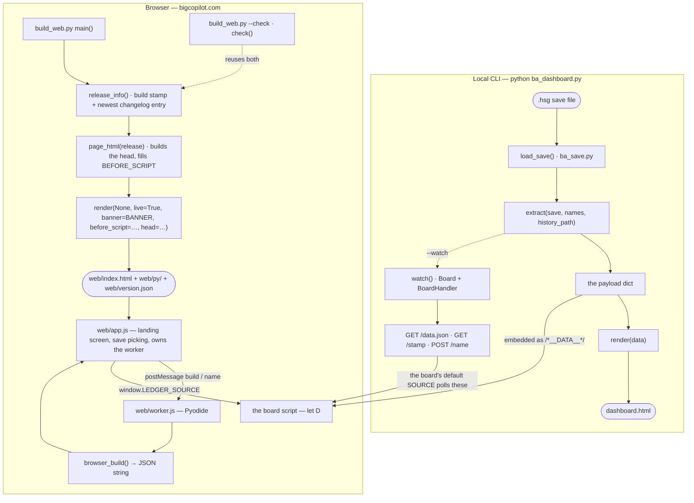

# Architecture

How a save becomes a board, through either front door. Read this before you change how
Python data reaches the page, add a key to the payload, add a page, or add a template
placeholder. For where files live and what to run afterwards, see [AGENTS.md](../AGENTS.md).

Code is located by search anchor, not line number.

## The two front doors

Both doors run the same `extract()` and the same `TEMPLATE`. Only the wrapper differs:
locally `main()` calls `load_save()` and `render(data)`; in the browser `web/worker.js` calls
`browser_build()`, which does the same work on Pyodide's virtual filesystem and returns
JSON. A third source feeds either door: the Big Copilot Link mod serves the running
game's own save bytes on loopback HTTP ([game-link-api.md](game-link-api.md)), and
`--game` on the CLI or "Link to the game" in the browser takes the bytes from there.
Those bytes are a normal `.hsg`, so nothing downstream knows where they came from.

## The payload contract

Every top-level key of the dict `extract()` returns, what produces it, and which functions
read it.

**Reader convention.** A reader is a function whose *own body* references `D.<key>` —
`D?.<key>` and `D["<key>"]` included, as is destructuring off `D`. A reference inside an
anonymous callback is credited to the nearest enclosing named function; a nested named
helper is written `outer/inner`, and a callback stored on an object literal is written by
its property path. Functions that only receive the data from a caller are not listed, so
this column is where to look when you change a key's shape — not a complete call graph.

| Key | Produced by | Read by |
| --- | --- | --- |
| `meta` | `extract()` inline, with `_city_date()` and `_difficulty()` | `drawMast`, `drawWeekday`, `drawSite`, `drawOrderChecklist`, `drawLogistics`, `drawFooter`, `fvOpenDiff`, `drawDifficulty`; `web/map.js` `refreshCityMaps`; `web/wiki.js` `wikiGuidePrices` |
| `kpi` | `extract()` inline, with `_net_worth()` | `drawMast`, `drawKpis` |
| `daily` | `_daily_series()`, plus the rolling `profit7` added in `extract()` | `drawChart`, `drawKpis`, `drawKpis/hist` |
| `businesses` | `_business()` per rented non-residential building | `drawPortfolio`, `drawSitePicker`, `openSite`, `drawSite`, `drawWeekday`, `drawOrderChecklist`, `drawLogistics` and its locals `held`, `label`, `users`, `factoryView/held`, `alertSite`, `nameUses`, `supplyLocation`, and the `SUPPLY_VIEWS` callbacks `shops.row`, `shops.verdict`, `imports.row`, `imports.verdict`, `idle.row`, `idle.verdict`, `lines.row`, `feed.row`, `feed.verdict`; `web/map.js` `mapBusinesses`; `web/wiki.js` `wikiOwn`, `wikiGuideOwn`, `wikiGuidePrices` |
| `ownedBuildings` | `_owned_buildings()` | `web/map.js` only: `CityMapView.update`, `openLocationMap` |
| `homes` | `_homes()`, with `m` and `hood` from `load_buildings()` | `spHome`; `web/map.js` `CityMapView.update`, `openLocationMap` |
| `products` | `_products()`, with `peak`/`swing`/`weeks` from `_product_rhythm()` | `drawProducts`; `web/wiki.js` `wikiOwn`, `wikiGuideOwn` |
| `staff` | `_staff_summary()` | `drawKpis`, `drawPayroll` |
| `loans` | `_loans()` | `drawKpis` |
| `supply` | `_supply()` | `drawLogistics`, `drawOrderChecklist`, `drawSite`, `drawFlow`, `drawFlowDetail`, `flowLayout`, `supplyLocation`, `factoryView`, and the `SUPPLY_VIEWS` callbacks `shops.rows`, `imports.rows`, `imports.note`, `imports.verdict`, `idle.rows`, `idle.verdict`; `web/map.js` `refreshCityMaps` |
| `rhythm` | `_chain_rhythm()`; its `recent` key holds the same three series over the last `RHYTHM_RECENT_DAYS` (28) days, which the chart draws, while the full-length ones feed `_supply()` | `weekdaySeries` (which `drawChart` asks), `drawSite` |
| `market` | `_market()`; its `catalogue` key is popped out and handed to `_plan()` | `drawMovers`, `drawMarket`; `web/wiki.js` `wikiOwn`, `wikiGuidePrices` |
| `premises` | `_premises()`, with `_premises_status()`, `_premises_demand()`, `_rent_estimate()`, `_deposit_estimate()`, `_deposit_check()`, `_door_caps()`, `_rival_numbers()`, `_rival_names()` | `drawFindLocation`, `findPremisesLink`, `wireCards`; `web/map.js` `premises` |
| `chains` | `_chains()` | `drawPortfolio` |
| `trends` | `_site_trends()` | `indexTrends` |
| `hypeExposure` | `_hype_exposure()` | no reader — but see below |
| `hours` | `_hourly()`, the sites with hour reports behind them | `drawSite` |
| `hourFindings` | `_hour_findings()` | `drawSite` |
| `staffing` | `_staffing()`, with `_plan_site()`, `_need_curve()`, `_arrival_ceiling()`, `_cut_run()`, `_bridge_troughs()`, `_hires_for()`, `_plan_people()`, `_current_roster()`, `_index_table()`, `_shift_row()` | `drawSite` through `spRosterBlock`, and `drawOptimizeStaffing` for the Next-moves card |
| `plan` | `_plan()` | `drawPlan`, `planDraw`, `indexPlan`, `factoryView`, `factoryCounts`, `planTypes`, `defaultRate`, `itemName`; `web/wiki.js` `wikiCanPlan` |
| `itemNames` | `extract()` inline, every `ba:itemname_` key of `names.locale` | `itemName` |
| `cashFlow` | `_cash_flow()` | `drawKpis` |
| `ledgerDays` | `extract()` inline, `len(ledger)` | no reader — but see below |
| `alerts` | `_alerts()`, its `lines` | `drawAlerts`, `kindCounts`; `web/map.js` `mapFindings` |
| `minor` | `_alerts()`, its `minor` | `drawAlerts`, `kindCounts`; `web/map.js` `mapFindings` |
| `goals` | `_goals()` | `drawGoals` |
| `weekly` | `_weekly()` | no reader |

Three indirect routes an agent would otherwise miss:

- `drawStock` references no key of its own. The Checks view gets its rows through the
  `SUPPLY_VIEWS` entry selected by `stockView`, and those callbacks do the reading. Change a
  shape in `supply` or `businesses` and it is `SUPPLY_VIEWS` you have to follow, not
  `drawStock`.
- The whole location finder reads `premises` through one accessor,
  `const premises = () => D?.premises || null` in `web/map.js`. Every `CityMapView` method
  that ranks, filters or describes a building goes through it, so that one line is the seam
  to follow when the key's shape changes.
- `#cellDetail`, the site panel and the map cards are filled from data already in hand, so
  they do not appear above.

Three keys have no reader, and only one of them is dead end to end:

- `weekly` is genuinely unread. `_weekly()` feeds nothing else.

`_hourly()` returns every trading site and flags each `reported`. `extract()` passes the
whole list to `_staffing()` and only the reported ones to the `hours` key and
`_hour_findings()`, so a shop too new to have been measured is planned — its cleaning and
security cover and its hiring lines do not wait on a measurement — without the hour grid
starting to draw an empty week for it.

A site the planner cannot plan still gets a row, `{key, name, typeSlug, failed: true}`
and nothing else, so the page can say so rather than leave a hole where a shop was; a row
without `failed` is a whole plan. Each site is planned against its own copy of the week and
of the bench, written back only once its row is built, so a site that falls over leaves no
phantom hours behind for the next one to hire around.

A `staffing` row carries two lookup tables, `stations` and `people`, and every row under it
points into them by index rather than repeating an id: `s` a station, `p` a person or null.
A save's ids are 24 characters of base64 and a fragmented site has hundreds of shift rows
between `shifts` and `current.list`, so on the reference save the tables take the key from
210 KB to 90 KB. Those two lists, and only those two, use short keys — `d` weekday, `f` and
`t` the hours a shift runs from and to, `k` the kind of duty, left off entirely on an
ordinary serving shift. `roles[].stations` holds indices into the same `stations` table.

The board reads all of it in one place, `spRosterBlock()` in `drawSite()`, which is reached
only for a `retail` site — an office, a depot, a factory and a home have no row. It builds
its rows through `spRosterRows()`, and the rest of the block is small pure helpers next to
it: `spRosterMeasured()` (does any hour have a basis other than `none`), `spSameDays()`
(which weekday is a copy of which), `spOpenAt()` (are the doors open that hour),
`spNeedAt()` (the need strip's height and its least certain basis for one hour),
`spTickId()`/`spTicksRead()`/`spTicksWrite()`/`spTyped()` (the player's own ticks, in
`localStorage` under `ba_dash_roster:<site key>`, every access wrapped because a browser
may refuse), and `spRosterCounts()`. `drawOptimizeStaffing()` reads the same key for the
Next-moves card, through `spBestRoster()`.

`shifts` carries the lines nobody at the site may legally work as well as the ones somebody
can be put on: same row, `p: null`. The page draws those dashed and cannot tick them, so
`spRosterCounts()` returns `{plan, tickable, hire, now, fragments}` and everything that
means "the week to type" reads `tickable` — the *Shifts / week* tile, the ring (through
`data-tickable`, which `spRosterBlock()` works out once for the retally to read back) and
`spBestRoster()`, which both scores and sizes the Next-moves card on it. `spDrawn()` is the
single rule for what reaches the page, shared by `spRosterRows()` and the counts, so the
two cannot drift.

A tick's id is the line the player typed — weekday, station id, `f`, `t`, person id — not
the payload's indices, which are renumbered whenever the tables are rebuilt. It is a JSON
array rather than a joined string, because an id is a string out of a save and may contain
whatever separator was picked; and a line whose station or person the save gives no id to
is drawn but not tickable, because there would be nothing to tell it from the next such
line. `spTickId()` returns null for one of those, and `spTickable()` keeps it out of the
counts. That is the
whole invalidation: a plan that changes any part of a line changes its id, the tick stops
matching and the next write drops it. Nothing is migrated; an old-format tick simply never
matches again.

One ceiling and one role: a capped hour's cell carries `data-caps`, a space-separated list
of `<kind>:<skill>` tokens (`door` alone for the building), and a cap chip's `data-show`
carries the same tokens, worked back out of the finding's own words by `spLimitShow()` and
`spLimitRole()`. Hovering a chip lights the cells holding *every* token it names. Keying on
the kind alone let two findings of one kind on two different roles light each other's
hours, and a tie between people and posts light neither's.
- `hypeExposure` — the *key* is unread, but `_hype_exposure()` is not dead. `extract()`
  binds its result to `hype` and passes it to `_alerts()`, which is where hype findings come
  from. Delete the payload key if you like; do not delete the function.
- `ledgerDays` — likewise the *key* is unread, but the `ledger` it counts is what
  `_cash_flow()` reads. The history write and `history.ledger()` both have to stay.

The payload crosses the worker boundary as a JSON string: `browser_build()` returns
`json.dumps(data)`. `render(data)` calls `json.dumps` too, so a value that is not
JSON-serialisable breaks **both** doors, not just the browser.

The payload is also meant to be identical across runs of the same save. Set iteration order
follows Python's per-process hash seed, so anywhere a set decides the order of something
that reaches the payload, sort it through `_in_order()` — which puts `None` last, because
real saves hold items with no name. Business lines, factory `arrivals` and `depotOther`
already go through it.

## Template placeholders

`TEMPLATE` carries fourteen tokens. All fourteen are substituted by `render()`, but the
text for two of them is supplied by the caller.

| Token | Filled with |
| --- | --- |
| `__TITLE__` | `render()`: `<save name> · Big Copilot`, HTML-escaped because the save name is the player's own text; plain `Big Copilot` when there is no data |
| `/*__DATA__*/null` | `render()`: the `extract()` payload as JSON with `</` escaped, or `null` for the browser build |
| `/*__LIVE__*/false` | `render()`: `true` when called with `live=True` |
| `<!--__BANNER__-->` | `render()`'s `banner=` argument. `build_web.py` passes its `BANNER` (the landing screen); the local page passes nothing |
| `<!--__BEFORE_SCRIPT__-->` | `render()`'s `before_script=` argument. `page_html()` passes a filled-in `BEFORE_SCRIPT`; the local page passes nothing |
| `<!--__CHANGELOG__-->` | `render()`, from `web/changelog.json`, newest first |
| `<!--__FOOTER__-->` | `render()`, from `footer_html(site=...)`. The same function fills the landing's footer inside `BANNER`, so the two cannot drift; `render()`'s `site=` argument decides whether the legal links ride along, and only `build_web.py` passes it |
| `/*__MAP_CSS__*/` | `render()`, from `web/map.css` |
| `/*__MAP_SCRIPT__*/` | `render()`, from `web/map.js` |
| `/*__MAP_PAYLOAD__*/` | `render()`, from `web/maps/locations.json` plus the base64 background — only for a standalone export (`data`, not `live`, not `map_external`) |
| `/*__WIKI_CSS__*/` | `render()`, from `web/wiki.css` if present |
| `/*__WIKI_SCRIPT__*/` | `render()`, from `web/wiki.js` if present |
| `/*__WIKI_PAYLOAD__*/` | `render()`, from `web/wiki-data.json`; skipped when `live=True`, because the hosted build fetches it with the build stamp instead |
| `/*__HOOD_TAGS__*/{}` | `render()`, from `HOOD_TAG` — one neighbourhood-tag table shared by the board and the wiki |

Only the wiki files are optional. `render()` reads them through `optional_asset()`, so a
checkout without `web/wiki.js` still renders a whole board and the Wiki tab is left out of
the navigation (`PAGES` tests for `showWikiRoute`). `web/map.js` and `web/map.css` are
opened directly: delete either and `render()` raises.

`build_web.py` has a second, private set of tokens — `__STAMP__`, `__RELEASE__`,
`__UPDATE_SCRIPT__`, `__BUILD__`, `__ICON_FOLDER__`, `__ICON_MORE__`. Those are
substituted inside `BANNER` and
`BEFORE_SCRIPT` before either string reaches `render()`, so they never appear in `TEMPLATE`.

## Assembly order of `web/index.html`

`main()` prepares `web/`, then hands off: `release_info()` returns the build stamp and the
newest changelog entry, and `page_html(release)` returns the whole page. `main()` itself
never touches the head or `BEFORE_SCRIPT`.

What `page_html()` produces, top of the file down:

1. `<!doctype html>` then `<meta charset="utf-8">`, both emitted by `render()` before the
   template, so the page runs in standards mode.
2. The head `page_html()` builds, in this order: the viewport tag and the
   `web/community.css` link stamped with the release version. There is no analytics
   script, and Cloudflare's automatic Web Analytics injection is switched off for the
   domain, because the privacy notice says the site runs none. `page_html()` then swaps the
   template's Google Fonts links for `web/fonts/fonts.css`, stamped the same way.
3. `TEMPLATE`, with the landing screen (`BANNER`) substituted into its `<!--__BANNER__-->`
   slot: the release banner, the drop zone, the save-location help and the footer.
4. `BEFORE_SCRIPT`, filled in by `page_html()` with the stamp, the release JSON and the
   inlined `web/update.js`, in its slot just ahead of the board's own script:
   `window.LEDGER_BUILD`, `window.LEDGER_RELEASE`, `update.js`, `app.js?v=<stamp>`,
   `community.js?v=<stamp>`.
5. The board script, the last `<script>` block of `TEMPLATE`.

Before any of that, `main()` refreshes `web/wiki-data.json`, copies `ba_save.py`,
`ba_dashboard.py`, `ba_buildings.json` and `ba_demand_curves.json` into `web/py/`, and
writes `web/py/gametext.json` from the installed locale — everything `stamp()` hashes has to be in place before
`release_info()` runs. `main()` then writes `web/index.html` and `web/version.json`.

`ships()` decides what of the locale travels in `gametext.json`, and nothing else does. It
keeps the display names (`NAME_PREFIXES`: items, business types, neighbourhoods,
workstations, skills, and job demands with their descriptions), the `recipes_*` keys and the `help_recipes_*_content` pages, the
workstation help pages, the business-type help pages, the item help pages whose body contains
`Customer Capacity` or `employee station` (which is how cleaning, computer and security
stations travel), and
`help_building_types_content`, which is where the premises table gets its size-code-to-door-cap
mapping. A page the analysis needs but `ships()` does not keep is simply absent in the
browser, with no error — so adding a lookup means adding its key here and rebuilding.

`python build_web.py --check` calls `check()`, which reuses the same `release_info()` and
`page_html()` and compares their output against what is committed under `web/`. That is why
it needs no installed game: it re-derives the page from the sources and the committed
`gametext.json` and `wiki-data.json` rather than rebuilding them. `stamp()` normalises CRLF
to LF for everything except the `.svg` background, so a Windows checkout is not stale by
itself.

### The seam: `window.LEDGER_SOURCE`

The board script does not know which door it is behind. It reads
`const SOURCE = window.LEDGER_SOURCE || { ... }`, and the fallback is the local watch
server: `data()` fetches the `data.json` route, `name()` POSTs to `name`, and `watch()`
polls `stamp` every 15 seconds and pulls fresh numbers only when the stamp moves.

`web/app.js` sets `window.LEDGER_SOURCE` before the board script runs. Its three members
satisfy the same contract: `data()` resolves to a fresh data object (by posting a `build`
message to the worker), `name(rid, slug)` records a factory-line name and resolves to the
data that follows, and `watch(h)` keeps the callbacks `changed(data)`, `stale(why)` and
`lost()`. The bytes behind `data()` can come from the game link as well as from a folder
handle or a file: when the player has linked the page to the running game, `app.js` fetches
the save from the Big Copilot Link mod on the player's own loopback
([game-link-api.md](game-link-api.md)) and hands the worker the same kind of `File`.

What that does and does not change. On the hosted site the save itself never leaves the
tab: `LEDGER_SOURCE` replaces the three watch-server routes, so nothing about the save is
fetched or posted — unless the player has linked the page to the running game, in which
case `app.js` fetches the bytes from that mod on the player's own machine, and to nowhere
else. The page still uses the network for its own assets, all same-origin.
The static ones are versioned, so a deploy busts their caches: `web/map.js` fetches
`maps/locations.json` with the build stamp and the background image with its own content
hash, and `web/wiki.js` fetches `wiki-data.json` with the build stamp. The dynamic ones
carry no version, because the whole point is to see the current state: `web/update.js`
polls `version.json` with `cache: "no-store"`, and `web/community.js` calls
`/api/community/*`. Nothing comes from another origin: `TEMPLATE` links Google Fonts for
the local `dashboard.html`, but `build_web.py` swaps those links for the site's own copies
in `web/fonts/`, so the privacy notice (`web/privacy.html`) can name Cloudflare as the
only party that sees a request. `tests/test_privacy_promises.py` holds the site to that.

Order matters. `BEFORE_SCRIPT` must stay ahead of the board script, or the board falls back
to fetching `data.json` from a site that has no such route.

## Pages

`const PAGES =` in the board script lists the top-level pages; `SUBS` lists the views inside
three of them. Each page is a `div.page` that `showPage()` unhides.

| Page (`id`) | Host element | Drawn by |
| --- | --- | --- |
| Today (`today`) | `pageToday` | `drawKpis` (`#kpis`), `drawAlerts` (`#alertSection`), `drawFindLocation` and `drawOptimizeStaffing` (each card's live count, its sentence about this save and the line naming where it goes); the "Plan imports" card is painted by `paintPlanImports` from `drawOrderChecklist`, with `planImportsState()` counting the same rows and ticks as the checklist |
| Company (`company`) | `pageCompany` | one view at a time — see below |
| Supply (`supply`) | `pageSupply` | one view at a time — see below |
| Growth (`growth`) | `pageGrowth` | one view at a time — see below |
| Map (`map`) | `pageMap` | `showCityMap` / `refreshCityMaps` in `web/map.js`, which also hosts the location finder as a mode of the page — `openFinder()` switches it on, and `CityMapView` ranks the `premises` rows beside the map |
| Wiki (`wiki`) | `pageWiki` | `wikiVisit` → `showWikiRoute` in `web/wiki.js`; the entry is omitted when `showWikiRoute` is undefined |

Company's views:

| View | Section | Drawn by |
| --- | --- | --- |
| Results | `secDaily` (its By weekday option, `drawWeekday`, replaced the Weekly rhythm section; an old `#secRhythm` link lands here through `SEC_MOVED`), `secPortfolio`, `secDetail` | `drawChart`, `drawPortfolio`, `drawSitePicker` + `drawSite` |
| Products | `secProducts` | `drawProducts` |
| Payroll | `secPayroll` | `drawPayroll` |
| Milestones | `secGoals` | `drawGoals`; the difficulty is not here but a chip on the masthead's build line (`drawMast`) and, on a phone, the footer (`drawFooter`, `#footDiff`), built by `fvDiffChip()`, with a body-level popover (`#fvDiffPop`) from `drawDifficulty()` |

Supply's views:

| View | Section | Drawn by |
| --- | --- | --- |
| Orders | `secLogistics` | `drawLogistics`, plus `drawOrderChecklist` for the change checklist |
| Checks | `secStock` | `drawStock`, which renders whichever entry of `SUPPLY_VIEWS` is selected (`shops`, `imports`, `idle`, `lines`, `feed`) |
| Goods flow | `secFlow` | `drawFlow`, plus `drawFlowDetail` for the panel under the diagram |

Growth's views:

| View | Section | Drawn by |
| --- | --- | --- |
| Demand | `secMarket` | `drawMovers` (`#movers`) and `drawMarket` (`#market`) |
| Plan a chain | `secPlan`, `secIngredients` | `drawPlan` |

Outside the pages, `drawMast` and `drawFooter` own the masthead and footer, and
`indexTrends` builds the lookup the other draws use. `renderAll()` calls them all;
`PAGE_ALIASES` keeps old hashes such as `#results` working after a page became a view.

Adding a page means: a `div.page` in the markup, an entry in `PAGES` (with `newFeature` if
it deserves a badge — see [contributing.md](contributing.md)), and a draw function called
from `renderAll()`.

## Pyodide

`web/worker.js` is a **module worker** — some embedders refuse a cross-origin
`importScripts` but allow a dynamic `import`. Pyodide is pinned to **314.0.6** and served
from this site, out of `web/pyodide/v314.0.6/`, so no visitor's IP address reaches a CDN.
With no `loadPackage` call, `loadPyodide` needs five files: `pyodide.mjs`,
`pyodide.asm.mjs`, `pyodide.asm.wasm`, `python_stdlib.zip` and `pyodide-lock.json`, plus
Pyodide's `LICENSE` (MPL-2.0) beside them. They are committed, not fetched at deploy time,
because a deploy from a checkout that lacks them would remove them from the site.
`web/_headers` caches the versioned folder as immutable. To upgrade, download the same
files from `https://cdn.jsdelivr.net/pyodide/v<version>/full/` into a new version folder,
change `PYODIDE_VERSION` in `web/worker.js`, and delete the old folder.

Everything else it fetches is same-origin, from `web/py/`, carrying the page's build stamp:

- `ba_save.py` and `ba_dashboard.py` — a failed fetch throws and the worker never becomes
  ready.
- `gametext.json`, `ba_buildings.json` and `ba_demand_curves.json` — written into the
  virtual filesystem only when the fetch succeeds, so a build missing one still boots and
  degrades instead: without the curves the board states no arrival ceiling, and every number
  it does state still comes off the measured hour grid.

On top of those, the worker writes at runtime: the save bytes under `/save`, the player's
optional `en.json` and the history JSON under `/data`, and Python itself writes a
`<history>.character` sidecar. Nothing else exists on that filesystem — which is why
`ba_dashboard` must not open a file at import time. See the trap in
[AGENTS.md](../AGENTS.md).

Two entry points, both called through `py.runPython` with paths interpolated as JSON:

- `browser_build(save_path, locale_path, history_path, names_path)` — parse, extract, and
  return the payload as a JSON string. It also writes `<history_path>.character` so a later
  name can be filed under the right company without reparsing the save.
- `browser_name(history_path, rid, slug)` — record a factory-line name; the worker then
  rebuilds from the save already in the filesystem.

Two traps:

- `JSON.stringify(null)` produces JavaScript's `null`, which Python does not know. When you
  interpolate a nullable argument into a `runPython` string, emit `None` yourself — see how
  `pySlug` is built before `browser_name`.
- `FS.utime` takes **milliseconds**, the same unit the browser's `File.lastModified` gives.
  The board's "saved" stamp reads that modification time, so getting the unit wrong shows a
  save from 1970.

## Community API

`server/worker.mjs` is a dependency-free Cloudflare Worker serving three routes —
`POST /api/community/presence`, `POST /api/community/vote`, `GET /api/community/features` —
backed by D1 (`migrations/0001_community.sql`) and a curated `server/features.json`. It
lives outside `web/` on purpose: `web/worker.js` is the in-browser Python worker and must
stay independent of it. `wrangler.jsonc` serves `web/` as static assets and runs the Worker
first only for `/api/*`. The page side is `web/community.js` and `web/community.css`, which
only the browser build includes. Setup, secrets and the release steps:
[community-features.md](community-features.md).

## Wiki pipeline

`tools/build_wiki_data.py` reads the installed game — the shipped locale, the help menu's
table of contents, `ba_buildings.json` and the shipped business layouts — plus two
hand-authored files beside it, and writes `web/wiki-data.json`.

The two authored inputs do different jobs. `tools/wiki_sample.json` holds wording the
builder fills with facts (labels, notes, the gap sentences). `tools/wiki_topics.json` holds
whole articles — "How rent works" is the first — which travel through as the payload's
`topics`: they are the one part of the file the game does not write, so each carries its own
provenance line saying what it was checked against. Both are stamp inputs, so editing either
changes the build stamp.

The game-read page records are one per **unique help-page slug that has content**, in menu
order, not one per help-menu entry. `build_pages()` drops two kinds of entry and reports both rather
than swallowing them: a duplicate of an already emitted slug (the shipped file has one such
double entry, whose second prefix is unreachable through that slug), and a page whose body
the locale does not carry, since a record with no body would be an empty page rather than a
fact. The order of those two tests matters: a slug is only recorded as seen once it has been
emitted, so a later entry for a slug whose earlier one had no content is kept, not counted a
duplicate. Alongside the pages the payload carries the worked example, a guide per
customer-facing business type, and the `topics`.

For the game-read pages and the `wiki_sample.json` fill, no number is invented: what the game
does not state stays `null`, and any sentence whose facts cannot be filled is left out rather
than guessed. The hand-written `topics` are the exception by design (the rent article carries
fitted district rates) and say so in their own provenance lines. `build_web.py` calls
`write_public_wiki` before stamping, so the site always ships the payload its pages were
built against. Details:
[wiki-data-pipeline.md](wiki-data-pipeline.md).
