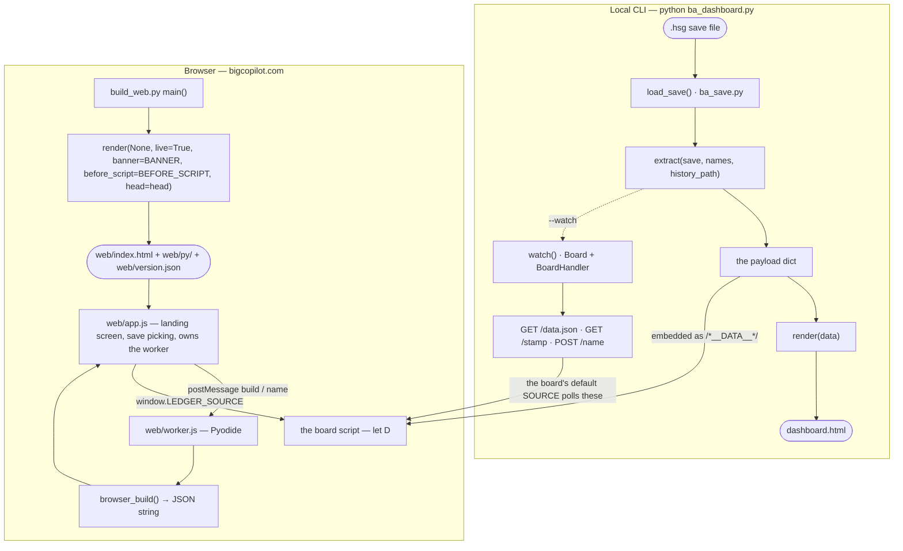

# Architecture

How a save becomes a board, through either front door. Read this before you change how
Python data reaches the page, add a key to the payload, add a page, or add a template
placeholder. For where files live and what to run afterwards, see [AGENTS.md](../AGENTS.md).

Code is located by search anchor, not line number.

## The two front doors

Both doors run the same `extract()` and the same `TEMPLATE`. Only the wrapper differs:
locally `main()` calls `load_save()` and `render(data)`; in the browser `web/worker.js` calls
`browser_build()`, which does the same work on Pyodide's virtual filesystem and returns
JSON.

## The payload contract

Every top-level key of the dict `extract()` returns, what produces it, and where the board
script reads it. A "no reader" row is dead weight in the payload — do not rely on it, and
say so if you remove it.

| Key | Produced by | Read by |
| --- | --- | --- |
| `meta` | `extract()` inline, with `_city_date()` and `_difficulty()` | `drawMast`, `drawSite`, `drawOrderChecklist`, `drawLogistics`, `drawGoals`, `drawFooter`; `web/map.js`, `web/wiki.js` |
| `kpi` | `extract()` inline, with `_net_worth()` | `drawMast`, `drawKpis` |
| `daily` | `_daily_series()`, plus the rolling `profit7` added in `extract()` | `drawKpis`, `drawChart` |
| `businesses` | `_business()` per rented non-residential building | `drawPortfolio`, `drawSitePicker`, `drawSite`, `drawRhythm`, `drawLogistics`, `drawOrderChecklist`, and the helpers `stockUnplanned`, `supplyLocation`, `factoryView`, `alertSite`, `nameUses`, `openSite`; `web/map.js`, `web/wiki.js` |
| `ownedBuildings` | `_owned_buildings()` | `web/map.js` only |
| `homes` | `_homes()` | `web/map.js` only |
| `products` | `_products()`, with `peak`/`swing` from `_product_rhythm()` | `drawProducts`; `web/wiki.js` |
| `staff` | `_staff_summary()` | `drawKpis`, `drawPayroll` |
| `loans` | `_loans()` | `drawKpis` |
| `supply` | `_supply()` | `drawLogistics`, `drawOrderChecklist`, `drawFlow`, `drawFlowDetail`, `drawSite`, and the helpers `flowLayout`, `stockUnplanned`, `supplyLocation`, `factoryView`; `web/map.js` |
| `rhythm` | `_chain_rhythm()` | `drawRhythm`, `drawSite` |
| `market` | `_market()`; its `catalogue` key is popped out and handed to `_plan()` | `drawMovers`, `drawMarket`; `web/wiki.js` |
| `chains` | `_chains()` | `drawPortfolio` |
| `trends` | `_site_trends()` | `indexTrends` |
| `hypeExposure` | `_hype_exposure()` | no reader |
| `hours` | `_hourly()` | `drawSite` |
| `hourFindings` | `_hour_findings()` | `drawSite` |
| `plan` | `_plan()` | `drawPlan`, and the helpers `indexPlan`, `factoryView`, `itemName`, `planTypes`, `defaultRate`, `factoryCounts`; `web/wiki.js` |
| `itemNames` | `extract()` inline, every `ba:itemname_` key of `names.locale` | `itemName` |
| `cashFlow` | `_cash_flow()` | `drawKpis` |
| `ledgerDays` | `extract()` inline, `len(ledger)` | no reader |
| `alerts` | `_alerts()`, its `lines` | `drawAlerts`, `kindCounts`; `web/map.js` |
| `minor` | `_alerts()`, its `minor` | `drawAlerts`, `kindCounts`; `web/map.js` |
| `goals` | `_goals()` | `drawGoals` |
| `weekly` | `_weekly()` | no reader |

The payload also crosses the worker boundary as a JSON string: `browser_build()` returns
`json.dumps(data)` and `web/app.js` hands the parsed object to the board. A key that is not
JSON-serialisable breaks the browser door while the local door keeps working.

## Template placeholders

`TEMPLATE` carries thirteen tokens. All thirteen are substituted by `render()`, but the
text for two of them is supplied by the caller.

| Token | Filled with |
| --- | --- |
| `__TITLE__` | `render()`: the escaped save name, or `Big Copilot` when there is no data |
| `/*__DATA__*/null` | `render()`: the `extract()` payload as JSON, or `null` for the browser build |
| `/*__LIVE__*/false` | `render()`: `true` when called with `live=True` |
| `<!--__BANNER__-->` | `render()`'s `banner=` argument. `build_web.py` passes its `BANNER` (the landing screen); the local page passes nothing |
| `<!--__BEFORE_SCRIPT__-->` | `render()`'s `before_script=` argument. `build_web.py` passes its `BEFORE_SCRIPT`; the local page passes nothing |
| `<!--__CHANGELOG__-->` | `render()`, from `web/changelog.json`, newest first |
| `/*__MAP_CSS__*/` | `render()`, from `web/map.css` |
| `/*__MAP_SCRIPT__*/` | `render()`, from `web/map.js` |
| `/*__MAP_PAYLOAD__*/` | `render()`, from `web/maps/locations.json` plus the base64 background — only for a standalone export (`data`, not `live`, not `map_external`) |
| `/*__WIKI_CSS__*/` | `render()`, from `web/wiki.css` if present |
| `/*__WIKI_SCRIPT__*/` | `render()`, from `web/wiki.js` if present |
| `/*__WIKI_PAYLOAD__*/` | `render()`, from `web/wiki-data.json`; skipped when `live=True`, because the hosted build fetches it with the build stamp instead |
| `/*__HOOD_TAGS__*/{}` | `render()`, from `HOOD_TAG` — one neighbourhood-tag table shared by the board and the wiki |

The wiki and map assets are optional: a checkout without `web/wiki.js` still renders a whole
board, and the Wiki tab is left out of the navigation (`PAGES` tests for `showWikiRoute`).

`build_web.py` has a second, private set of tokens — `__STAMP__`, `__RELEASE__`,
`__UPDATE_SCRIPT__`, `__BUILD__`, `__REPO__`, `__ISSUES__`, `__DONATE__`, `__ICON_FOLDER__`,
`__ICON_MORE__`, `__ANALYTICS_NOTE__`. Those are substituted inside `BANNER` and
`BEFORE_SCRIPT` before either string reaches `render()`, so they never appear in `TEMPLATE`.

## Assembly order of `web/index.html`

From `build_web.py`'s `main()`, top of the file down:

1. `<!doctype html>` then `<meta charset="utf-8">`, both emitted by `render()` before the
   template, so the page runs in standards mode.
2. The head that `main()` builds, in this order: the viewport tag, the Cloudflare Web
   Analytics beacon if `ANALYTICS_TOKEN` is set, and the `community.css` link stamped with
   the build version (`web/community.css`).
3. `TEMPLATE`, with the landing screen (`BANNER`) substituted into its `<!--__BANNER__-->`
   slot: the release banner, the drop zone, the save-location help and the footer.
4. `BEFORE_SCRIPT`, in its slot just ahead of the board's own script:
   `window.LEDGER_BUILD`, `window.LEDGER_RELEASE`, `web/update.js` inlined,
   `app.js?v=<stamp>`, `community.js?v=<stamp>`.
5. The board script, the last `<script>` block of `TEMPLATE`.

Before writing the page, `main()` refreshes `web/wiki-data.json`, copies `ba_save.py`,
`ba_dashboard.py` and `ba_buildings.json` into `web/py/`, writes `web/py/gametext.json` from
the installed locale, and computes `stamp()` — an MD5 over everything the page fetches, so
one deploy is one version. It also writes `web/version.json`, which the update banner polls.

### The seam: `window.LEDGER_SOURCE`

The board script does not know which door it is behind. It reads
`const SOURCE = window.LEDGER_SOURCE || { ... }`, and the fallback is the local watch
server: `data()` fetches the `data.json` route, `name()` POSTs to `name`, and `watch()`
polls `stamp` every 15 seconds and pulls fresh numbers only when the stamp moves.

`web/app.js` sets `window.LEDGER_SOURCE` before the board script runs, so on the hosted site the
board never touches the network. Its three members satisfy the same contract: `data()`
resolves to a fresh data object (by posting a `build` message to the worker), `name(rid,
slug)` records a factory-line name and resolves to the data that follows, and `watch(h)`
keeps the callbacks `changed(data)`, `stale(why)` and `lost()`.

Order matters. `BEFORE_SCRIPT` must stay ahead of the board script, or the board falls back
to fetching `data.json` from a site that has no such route.

## Pages

`const PAGES =` in the board script lists the top-level pages; `SUBS` lists the views inside
three of them. Each page is a `div.page` that `showPage()` unhides.

| Page (`id`) | Host element | Drawn by |
| --- | --- | --- |
| Today (`today`) | `pageToday` | `drawKpis` (`#kpis`), `drawAlerts` (`#alertSection`); the "Next moves" cards are static markup |
| Company (`company`) | `pageCompany` | one view at a time — see below |
| Supply (`supply`) | `pageSupply` | one view at a time — see below |
| Growth (`growth`) | `pageGrowth` | one view at a time — see below |
| Map (`map`) | `pageMap` | `showCityMap` / `refreshCityMaps` in `web/map.js` |
| Wiki (`wiki`) | `pageWiki` | `wikiVisit` → `showWikiRoute` in `web/wiki.js`; the entry is omitted when `showWikiRoute` is undefined |

Company's views:

| View | Section | Drawn by |
| --- | --- | --- |
| Results | `secDaily`, `secRhythm`, `secPortfolio`, `secDetail` | `drawChart`, `drawRhythm`, `drawPortfolio`, `drawSitePicker` + `drawSite` |
| Products | `secProducts` | `drawProducts` |
| Payroll | `secPayroll` | `drawPayroll` |
| Milestones | `secGoals` | `drawGoals` |

Supply's views:

| View | Section | Drawn by |
| --- | --- | --- |
| Orders | `secLogistics` | `drawLogistics`, plus `drawOrderChecklist` for the change checklist |
| Checks | `secStock` | `drawStock`, which renders whichever entry of `SUPPLY_VIEWS` is selected (`shops`, `imports`, `idle`, `lines`, `feed`) |
| Goods flow | `secFlow` | `drawFlow`, plus `drawFlowDetail` for the panel under the diagram |

Growth's views:

| View | Section | Drawn by |
| --- | --- | --- |
| Demand | `secMarket` | `drawMovers` (`#movers`) and `drawMarket` (`#market`) |
| Plan a chain | `secPlan`, `secIngredients` | `drawPlan` |

Outside the pages, `drawMast` and `drawFooter` own the masthead and footer, and
`indexTrends` builds the lookup the other draws use. `renderAll()` calls them all;
`PAGE_ALIASES` keeps old hashes such as `#results` working after a page became a view.

Adding a page means: a `div.page` in the markup, an entry in `PAGES` (with `newFeature` if
it deserves a badge — see [contributing.md](contributing.md)), and a draw function called
from `renderAll()`.

## Pyodide

`web/worker.js` is a **module worker** — some embedders refuse a cross-origin
`importScripts` but allow a dynamic `import`. Pyodide is pinned to **314.0.6** and fetched
from jsDelivr; that one download is the only network call the worker makes.

It writes exactly four files into Pyodide's filesystem, all fetched from `web/py/` with the
page's build stamp: `web/py/ba_save.py`, `web/py/ba_dashboard.py`, `web/py/gametext.json`
and `web/py/ba_buildings.json`. Anything else the Python wants must be read lazily, inside a
function, or it will not exist — that is why `load_buildings()` falls back to the worker's
`/data/ba_buildings.json` and `render()` opens `web/changelog.json` and the map assets from
inside the function body.

Two entry points, both called through `py.runPython` with paths interpolated as JSON:

- `browser_build(save_path, locale_path, history_path, names_path)` — parse, extract, and
  return the payload as a JSON string. It also writes `<history_path>.character` so a later
  name can be filed under the right company without reparsing the save.
- `browser_name(history_path, rid, slug)` — record a factory-line name; the worker then
  rebuilds from the save already in the filesystem.

Two traps:

- `JSON.stringify(null)` produces JavaScript's `null`, which Python does not know. When you
  interpolate a nullable argument into a `runPython` string, emit `None` yourself — see how
  `pySlug` is built before `browser_name`.
- `FS.utime` takes **milliseconds**, the same unit the browser's `File.lastModified` gives.
  The board's "saved" stamp reads that modification time, so getting the unit wrong shows a
  save from 1970.

## Community API

`server/worker.mjs` is a dependency-free Cloudflare Worker serving three routes —
`POST /api/community/presence`, `POST /api/community/vote`, `GET /api/community/features` —
backed by D1 (`migrations/0001_community.sql`) and a curated `server/features.json`. It
lives outside `web/` on purpose: `web/worker.js` is the in-browser Python worker and must
stay independent of it. `wrangler.jsonc` serves `web/` as static assets and runs the Worker
first only for `/api/*`. The page side is `web/community.js` and `web/community.css`, which
only the browser build includes. Setup, secrets and the release steps:
[community-features.md](community-features.md).

## Wiki pipeline

`tools/build_wiki_data.py` reads the installed game — the shipped locale, the help menu's
table of contents, `ba_buildings.json` and the shipped business layouts — and writes
`web/wiki-data.json`: a record per help page, the worked example, and a guide per
customer-facing business type. No number is invented; what the game does not state stays
`null`. The authored wording lives in `tools/wiki_sample.json`, and any sentence whose facts
cannot be filled is left out rather than guessed. `build_web.py` calls `write_public_wiki`
before stamping, so the site always ships the payload its pages were built against. Details:
[wiki-data-pipeline.md](wiki-data-pipeline.md).
