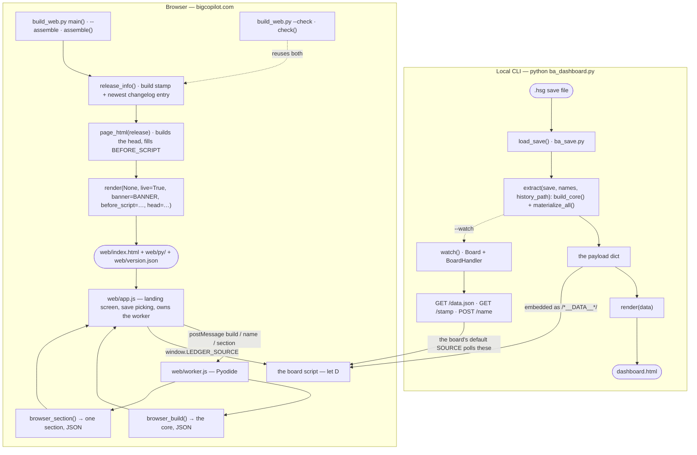

# Architecture

How a save becomes a board, through either front door. Read this before you change how
Python data reaches the page, add a key to the payload, add a page, or add a template
placeholder. For where files live and what to run afterwards, see [AGENTS.md](../AGENTS.md).
For every table a new finding kind, view, payload key, finder filter, footer link or news
item has to be added to, see [Registries](#registries).

Code is located by search anchor, not line number.

## The two front doors

```mermaid
flowchart TD
  save([".hsg save file"])

  subgraph local["Local CLI — python ba_dashboard.py"]
    direction TB
    save --> load["load_save() · ba_save.py"]
    load --> extract["extract(save, names, history_path): build_core() + materialize_all()"]
    extract --> payload["the payload dict"]
    payload --> renderL["render(data)"]
    renderL --> out(["dashboard.html"])
    extract -.->|"--watch"| watch["watch() · Board + BoardHandler"]
    watch --> routes["GET /data.json · GET /stamp · POST /name"]
  end

  subgraph web["Browser — bigcopilot.com"]
    direction TB
    bw["build_web.py main() · --assemble · assemble()"] --> ri["release_info() · build stamp + newest changelog entry"]
    ri --> ph["page_html(release) · builds the head, fills BEFORE_SCRIPT"]
    chk["build_web.py --check · check()"] -.->|"reuses both"| ri
    ph --> renderW["render(None, live=True, banner=BANNER, before_script=…, head=…)"]
    renderW --> index(["web/index.html + web/py/ + web/version.json"])
    index --> app["web/app.js — landing screen, save picking, owns the worker"]
    app -->|"postMessage build / name / section"| wk["web/worker.js — Pyodide"]
    wk --> bb["browser_build() → the core, JSON"]
    wk --> bs["browser_section() → one section, JSON"]
    bb --> app
    bs --> app
    app -->|"window.LEDGER_SOURCE"| board["the board script — let D"]
  end

  routes -->|"the board's default SOURCE polls these"| board
  payload -->|"embedded as /*__DATA__*/"| board
```

Both doors run the same `build_core()` and the same sections (`SECTIONS`, see
[Sections](#sections)), and the same template, `template/board.html` with the board script
`template/board.js`. Only the wrapper differs: locally `main()` calls `load_save()`,
`extract()` (the core and every section, `materialize_all()`) and `render(data)`; in the
browser `web/worker.js` calls `browser_build()`, which builds the core on Pyodide's virtual
filesystem and returns it as JSON, and `browser_section()` when a page asks for a section. A third source feeds either door: the Big Copilot Link mod serves the running
game's own save bytes on loopback HTTP ([game-link-api.md](game-link-api.md)), and
`--game` on the CLI or "Link to the game" in the browser takes the bytes from there.
Those bytes are a normal `.hsg`, so nothing downstream knows where they came from.

## The payload contract

Every top-level key of the dict `extract()` returns, what produces it, and which functions
read it. A key is the core's, computed on every build, unless the table says it is a
section's, computed when a page asks for it ([Sections](#sections)).

**Reader convention.** A reader is a function whose *own body* references `D.<key>` —
`D?.<key>` and `D["<key>"]` included, as is destructuring off `D`. A reference inside an
anonymous callback is credited to the nearest enclosing named function; a nested named
helper is written `outer/inner`, and a callback stored on an object literal is written by
its property path. Functions that only receive the data from a caller are not listed, so
this column is where to look when you change a key's shape — not a complete call graph.

| Key | Produced by | Read by |
| --- | --- | --- |
| `meta` | `extract()` inline, with `_city_date()` and `_difficulty()` | `drawMast`, `drawWeekday`, `drawSite`, `sbData`, `drawSupplyStrip`, `drawProductionView`, `drawFooter`, `fvOpenDiff`, `drawDifficulty`; `web/map.js` `refreshCityMaps`; `web/wiki.js` `wikiGuidePrices` |
| `kpi` | `build_core()` inline, with `_net_worth()` | `drawMast`, `drawKpis`, `hrReview/firstHire`, `SS_VIEWS.payroll.live` |
| `daily` | `_daily_series()`, plus the rolling `profit7` added in `extract()` | `drawChart`, `drawKpis`, `drawKpis/hist` |
| `businesses` | `_business()` per rented non-residential building; each site's `campaigns` and `marketingPlan` from `_marketing()`, with `marketing_plan()` and `marketing_score()` over `MARKETING_TYPES`, `MARKETING_STRENGTH` and `MARKETING_REACH`, planning with the types the site already has a switch for (flipped at any time) and those sold by agencies that are phone contacts, `agencies` naming the ones a new switch needs (`marketingPlan` is None but for a shop or an office; its `on` is None when the site has no switch, no agency is a contact and a change is needed); `_alerts()` reads it for the `promotion` findings | `drawPortfolio`, `drawSitePicker`, `openSite`, `siteKeys`, `drawSite`, `drawWeekday`, `supplyChecklistRows` and its locals `lineOf`, `held`, `label`, `factoryView/held`, `alertSite`, `nameUses`, Supply's views (`drawImportsView`, `drawDeliveriesView`, `drawProductionView`, `drawChangesView`) through their parts `sbShopsPart`, `sbDepotPart`, `sbFactoryPart` and row helpers (`sbObject`, `sbDepotRow`, `sbLineRow`, `sbInputRow`, `sbTabOf`), the Imports card `sbImportCard`, and `drawFactoryStaffing`, the marketing write's `gwMkSites` (with `spMkLine` and `gwMarketing` reading each site's `marketingPlan`); `web/map.js` `mapBusinesses`; `web/wiki.js` `wikiOwn`, `wikiGuideOwn`, `wikiGuidePrices` |
| `ownedBuildings` | Core: `_owned_buildings()`; cheap map layers (Sections) | `web/map.js` only: `CityMapView.update`, `openLocationMap` |
| `homes` | Core: `_homes()` (cheap map layers; Sections), with `m` and `hood` from `load_buildings()` | `spHome`, `siteKeys`; `web/map.js` `CityMapView.update`, `openLocationMap` |
| `products` | Section `products`: `_products()`, with `peak`/`swing`/`weeks` from `_product_rhythm()` | `drawProducts`, `SS_VIEWS.products.live`, `ssBuild`; `web/wiki.js` `wikiOwn`, `wikiGuideOwn` |
| `staff` | Core: `_staff_summary()` | `drawKpis`, `drawPayroll` |
| `loans` | `_loans()`; each loan carries its bank's site `key` | `drawKpis`, the `SS_VIEWS` `cash` entry's `live()`, and `osRoiLoan()` (Open a store, step 6) |
| `supply` | `_supply()`; its `facts` from `_supply_facts()`, each fact's status word from `_supply_status()`; `margin` and `roundTo` are `SUPPLY_MARGIN` and `SUPPLY_ROUND_TO`; `roundTo` has no board reader, since the rounding is done in Python before the numbers ship | `supplyChecklistRows`, `sbData`, Supply's five view drawers (with `sbDepotRows`, `sbTabOf`, `sbDeps`, `sbNodeOpen`, `drawFlowPanel`), `pgEvaluate` (a later board's evidence for an applied write), `drawSite`, `drawFlow`, `flowLayout` (its columns are `flowStages`' stages), the phone chain's `flowStages`, `drawFlowChain`, `drawFlowFocus` and `flowPipeProblem` (which reads each `graph.links` entry's `slugs`, the products its pipe carries), `factoryView`; `web/map.js` `refreshCityMaps`. `supply.facts` only through `supplyFact()` (below), and `supply.idle` only through `idleRows()`, which keeps the rows idle under the sizing on screen (`modes`) with their `dem` laid over. `supply.wholesaleShops` (the shops a repeating wholesale contract delivers to) has no board reader: `_alerts()` counts it as a delivery plan. `supply.routed` (the `[shop index, product]` pairs a stock target above zero or a weekly wholesale contract delivers, whatever the shop sells) is read only by the Open a store checklist's Logistics row, `osRoutes()` |
| `rhythm` | `_chain_rhythm()`; its `recent` key holds the same three series over the last `RHYTHM_RECENT_DAYS` (28) calendar days before the last finished day, which the chart draws, while the full-length ones feed `_supply()` | `weekdaySeries` (which `drawChart` asks), `drawSite` |
| `market` | `_market()`; its `catalogue` key is popped out into the build's private data (`build.private["catalogue"]`) and handed to `_plan()` | `drawMovers`, `drawMarket`; `web/wiki.js` `wikiOwn`, `wikiGuidePrices` |
| `premises` | Section `premises`: `_premises()`, with `_premises_status()`, `_premises_demand()`, `_rent_estimate()`, `_deposit_estimate()`, `_deposit_check()`, `_door_caps()`, `_rival_numbers()`, `_rival_names()` | `drawFindLocation`, `finderPreset`, `wireCards`; `web/map.js` `premises` |
| `chains` | `_chains()` | `drawPortfolio`, `siteCrumbs` |
| `payback` | `_payback()`, with `_site_setup()` and `setup_cost()` (the investment in both install modes, reusable for a store not yet rented; `vehicles` the site's own, from `_site_vehicles()` and `_vehicle_deliveries()`), `_install_bills()`, `_payback_row()`, `payback_outcome()` and `_payback_rate()`; `History.payback()` keeps the firm's bill, each vehicle's delivery and each reached break-even day after the save forgets them (an older save of the same character reads it and writes nothing). An outcome is `reached`, `latest`, `togo`, `never`, `unknown`, or `window` for a lease older than the statements: the whole payback period at recent profit, since what it earned before is unknown. `{sites: {key: …}, chains: {first site key: …}, recentDays}`; a trading site whose run from the opening is known also carries `days` (`[day, profit, sales]` from the opening) and `before` (the lease's cost before it); `_payback_trail()` keeps and extends those days in the history after the record stops reaching the opening, and a site whose kept days no longer meet the record says `rolled` | `paybackSite`, `paybackChain`, through `drawPortfolio`'s Payback column, `spPayback()` in `drawSite()` and `osRoiHtml()` (Open a store, step 6) |
| `openStore` | Section `openStore`: `_open_store()`, in the "open a store" section after `_payback()`: `load_store_rules()` (`ba_store_rules.json`), `outfit_lines()` (a 100% outfitted store per type and layout, `setup_cost()` pricing it), `decor_route()` (the cheapest walls and floors to each neighbourhood's interior score, kept per layout and score), `_layout_slots()`, `_copied_shelving()`, `_store_market()` (per product: import cost, sellers and rival prices per neighbourhood, `demand_with()`/`optimal_providers()`), `_plan_initial()` (the arrivals each hour starts from, `_initial_customers()` shared with the staffing assistant), `_own_shops()` (the player's shops as the model sees them, measured from each one's first day with sales; `k` for one still in its first days) and `_own_sales()` (what they sell), `_opened_stores()` (per business of a planned type: the furniture standing in it, which opening requirements it meets, `required_placed()`, and what it offers for sale, the game's provider count), `_finance_facts()` (banks, wealth with vehicles and boats, the tutorial's floor, and borrowing room). The facts only; the arithmetic the reader moves runs in the board. `{game, types, market, hoods, decor, items, vendors, own, sales, built, campaigns, finance}`, or `{}` when the store rules are missing | `drawOpenStore` (Expansion › Open a store), with `osModel()`/`osOfficeModel()`, `osBestModel()`, `osDayProfit()` (the first days' ramp and a first seller's hype), `osBreakDay()`, `osOwnRatio()`, `osCannibal()` and `osLoan()`; `demCellPop()` (a Demand cell's Open a store here) |
| `openFactory` | Section `openFactory`: `_open_factory()`, after `_open_store()`: per recipe product and ingredient its wholesale price, the save's import price index, box size (`bx`) and importer cap (`mo`) from `ba_store_rules.json` (an ingredient the help names one way and the city trades another is read under the name the rules know, by its label); `_factory_kits()` (each workstation's machines at list price); the Pallet Shelf and its box capacity; the factory's truck and a new depot's van with their dealer; who sells the machines; per warehouse and factory the player runs its pallet shelves, the products import contracts deliver to it and its vehicles, and for a factory `_factory_days()` (what left it each finished day by its delivery log, and the piers' part from its sales); at headquarters the purchasing agents against the import contracts and the logistics managers against the sites they manage. `{game, skills, products, kits, shelf, vehicles, items, vendors, sites, hq}`, or `{}` when the store rules are missing | `drawPlan` (Expansion › Plan a factory) through `ofDraw()`: `ofInvestment()` (one-off, upfront), `ofRunning()` (raw material, wages, rent a week), `ofUntilRows()`, `ofRunHtml()`; the loan through `osLoan()` over `openStore.finance` |
| `trends` | `_site_trends()` | `indexTrends` |
| `hypeExposure` | `_hype_exposure()`; `extract()` also passes the same list to `_alerts()`, where the `hype` findings come from | `spHypeRow` (a `const` arrow function, called from `spPull()` for the site panel's Promotion block) |
| `hours` | `_hourly()`, the sites with hour reports behind them; optional `cinemaCapacity` from `_cinema_capacity()` identifies a verified furniture limit below the layout capacity, for core warnings | `drawSite` |
| `hourFindings` | `_hour_findings()`; `heldBy: [["furniture"]]` names a cinema furniture limit (with `["staff", role]` appended for tied understaffing), distinct from the neutral building limit `[["door"]]` | `drawSite` |
| `staffing` | Section `staffing`: `_staffing_section()`, which creates the planning world (`_plan_world()`: `_plan_people()` once, one week per person, one bench) and keeps the state shops leave for `officeStaffing`; `_staffing()`, with `_plan_site()`, `_need_curve()`, `_initial_customers()`, `_arrival_ceiling()`, `_cut_run()`, `_bridge_troughs()`, the placer `_place_week()` (hires as placeholder people, `_place_hires()`; the week of somebody already working there kept where a plan would cut them short on a partial week, `_worse_off()` and `_pin_weeks()`), `_current_roster()`, `_index_table()`, `_shift_row()` | `drawOptimizeStaffing` for the Next-moves card; `drawSchedules` through `spRosterBlock`; `drawSite` through `spSchedSummary` and `spSpareIds`; the hiring helpers |
| `factoryStaffing` | Section `factoryStaffing`: `_factory_staffing()`, once per sizing (`{cap, dem}`), with `_factory_site_plan()`, `_factory_run_start()` and the shop placer `_place_week()`, drawing on the unassigned factory workers the shops and offices left; its hours come from each factory line's `needHours`, `hoursNow` and `_posts` (the machines' ids, set by `_line_hours()` in `_factories()` on each line and on each unnamed line with a recipe, and taken off the payload by `build_core()` through `_take_posts()`, by the line's place in its list, into `build.private["posts"]`) | `drawFactoryStaffing`, through `drawProductionView` (it asks for the section); `sbFactoryPart` (reads it when there); `spSpareIds` for a factory; `hrPlanRow`; `pgPeopleSites` |
| `officeStaffing` | Section `officeStaffing`: `_office_staffing()`, with `_office_site_plan()`, `_office_need()` (customer history, with `_office_runs()` as fallback) and the shop placer `_place_week()`, drawing on the unassigned people no shop plan counts on (the bench `_staffing()` leaves in `_plan_world()`) | `drawSchedules` through `spOfficeRoster`; `drawSite` through `spSchedSummary` and `spSpareIds`; `hrPlanRow`, `gwOfficeRow` and the hiring helpers |
| `candidates` | Section `hiring`: `_candidates()`, with `_character()` and `_skill_rows()` | the Staff page; `gwWho` |
| `hiring` | Section `hiring` (after `factoryStaffing`): `_hiring()`, which reads each plan row's private `_hire` (`_hire_fields()`: `hireWeeks`, the placeholder hires' weeks from `_place_hires()`, each with its `band` from `_hire_band()` -- `full` at 30 hours or more, `part` from 10, `short` under -- and `shortHires`, the weeks under 10 hours as `{skill, hours}`; `spare`, `bench`) for `staffing`, `staffing[].fullCover`, `staffing[].openCover`, `factoryStaffing` and `officeStaffing` from `build.private["hires"]`, which `_take_hires()` filled as each plan was made; `accepts` from `ASSIGN_SKILLS`, `facts` from `_site_facts()`, `stations` from `_station_facts()` (the desk and chair demands each station meets), `company` from `_company_facts()`, `recruiting` from `_recruiting()` | the Staff page (`drawStaffPage` asks for the section); the site panel's Staffing block (`spRosterBlock`, through `spRowLess` and `hrFromCall`) and its writes (`gwRosterButtons`, `gwStaffButton`); Open a store's and Plan a factory's staff rows (`osCkStaff`, `osStaffAct`, `ofCkStaff`, `ofRunHtml`); the hire and schedule write dialogs (`gwConfirm` `needs`); `pgPeopleSites` |
| `plan` | Core: `_plan()` (Today reads its recipes and item names, and every page reads `itemName`; about 4 ms and 65 KB on the largest measured save); its `prices`, `priceFrom` and `priceDay` from `_ingredient_prices()`; each `catalogue` entry's `extra`, what the type can additionally sell as `[[slug, weight], ...]`, from `_plan_extra()` over `ba_store_rules.json` (`types[kind].i`, weight under 1); `own[kind].sellers`, how many of the type's shops sell each of those extras; the custom factory range reads every recipe and sums `perDay` times the `stocked` or `sellers` count across `own` through `ofCustomDemand()` | `drawPlan`, `planDraw`, `indexPlan`, `factoryView`, `factoryCounts`, `planTypes`, `defaultRate`, `itemName`, `sbDeps`, `ofPreset`, the `of*` planner adapters, Add product's `planAdded` and `pcPopOpen`; `web/wiki.js` `wikiCanPlan` |
| `names` | `_game_names()`: every `NAME_PREFIXES` key of `names.locale` but the `_description`s, plus `HOOD_LABEL` for a neighbourhood the text lacks | `itemName`, `gameName` (and through it `hoodName`), `englishName` (from the English payload), `localiseNames` |
| `marketingAgencies` | `_marketing_agencies()`: the city's agencies from `MARKETING_AGENCIES`, each with its name, address, whether it is a phone contact (`Contacts`), the types it sells, its opening slots per weekday (`_open_hours()`) and, at the save's clock, `open` and `opens` (`open_at()`, `next_open()`); `_marketing()` adds new switches through the contacts only; `extract()` also passes the list to `_alerts()`, which names the agencies to visit | `gwMkAgency`, the marketing write's lookups (`gwMkBlocked`, `gwMkWhy`, `gwMkVisit`, `gwMkAgencyOf`, `gwMkOpensOf`), judged at the game's clock from `LEDGER_SOURCE.link()`, which `web/app.js` moves on every `/health` read; `gwMkTick` (the source's `linkClock`) redraws the pages on screen when an agency opens or shuts |
| `skillNames` | `extract()` inline, every skill in `STATION_SKILLS` through `names.label()` | `gwSkillName` |
| `cashFlow` | `_cash_flow()` | `drawKpis` |
| `ledgerDays` | `extract()` inline, `len(ledger)` | no reader — but see below |
| `alerts` | `_alerts()`, its `lines`, with factory lines sized 24/7 | `alertLines()`, which `drawAlerts`, `kindCounts` and `web/map.js` `mapFindings` ask |
| `minor` | `_alerts()`, its `minor`, sized 24/7 | `alertLines()` |
| `alertsDemand` | `_alerts(..., "dem")`, a second pass over the same `supply.facts` with factory lines sized on demand: `{lines, minor}`, the shape of `alerts` and `minor` | `alertLines()`, when the sizing switch reads Demand |
| `goals` | Section `goals`: `_goals()` | `drawGoals` |
| `rivalry` | `_rivalry()`, from `_rival_weekly_incomes()`, `_player_weekly_income()` and `_rivalry_backfill()`; the days in first place are counted over `History.rivalry()`, the history's `rivalry` record. `null` when the save lists no rivals | `rlShown`, `drawKpis` (through `rlKpiTile`), `rlGoalsHtml` (from `drawGoals`) |

Four indirect routes an agent would otherwise miss:

- The Supply page's change checklist has one source. `supplyChecklistRows()` gathers the rows
  from `supply`, `businesses` and the plan, `sbData()` caches them with the player's marks,
  and `drawSupplyStrip()` (the counts of every view, the Overview's Calculate import amounts
  task) and the five view drawers all read `sbData()` rather than the payload. It is the one
  proposed-plan record: the Imports card, its Why and manual instructions, Copy remaining,
  the Overview's Details (`ovPlanHtml()`) and the game link's write all read the same row.
  Change a shape in `supply` or `businesses` and it is `supplyChecklistRows()` you have to
  follow; it also fills `gwImportRows`, which the game link's write-back reads.
- The whole location finder reads `premises` through one accessor,
  `const premises = () => D?.premises || null` in `web/map.js`. Every `CityMapView` method
  that ranks, filters or describes a building goes through it, so that one line is the seam
  to follow when the key's shape changes.
- Every supply verdict on the board reads `supply.facts` through one accessor,
  `supplyFact(s, slug)`: the fact for a site index and an item, its full-production fields
  with the fact's `dem` laid over them when the planning basis reads Shop demand (`sizing`,
  `cap` or `dem`, kept per character: `szRead()`, `szPick()`). Supply's views, the checklist, Goods
  flow and the site page all ask it, so none of them computes a verdict of its own; the
  Python twin is `_supply_fact()`, which the findings use. The findings themselves come
  twice, `alerts`/`minor` and `alertsDemand`, and `alertLines()` picks the pair by the same
  switch. A fact's figures (`use`, `need`, `have`, `setTo`, `lower`) are a week's where
  `cad` is weekly (an import or a wholesale delivery brings the item: a depot line, a
  factory input imported direct, a factory's own contract under `import`, a shelf on a
  wholesale contract) and a day's otherwise (a daily top-up brings it: a shelf, a depot
  fed only by a route from your own site, a factory input topped up each morning);
  `parts` is on a week's facts only. The board reads the unit through `szWeekly()`,
  `szDaily()` and `szWeekOf()`. Every (`st`, `why`) pair `_supply_status()` can send
  has a line in `SZ_WHY`; `named` and `unjudged` are the board's own, for a row Python
  has not judged.
- The facts are sized from the sources, never from the delivery log. `_plan_dag()` first
  cuts every loop in the plans the same way whatever the read order (from supply toward
  use), then `_supply_walk()`
  (module level, called from `_supply()`'s `walk()`) carries need up the logistics plans
  from the ends (each shop's week of sales, or its top-up target before it has sold any,
  with `SUPPLY_MARGIN` added there only; each factory line's draw in each sizing mode) and
  supply down from the imports (replayed through `_import_drop()` against the stock the
  routes keep), wholesale deliveries and factory output, giving every (site, item) its
  need, what its routes bring (capped by their targets and by the sender's own supply;
  what a sender merely holds is no supply) and whether they cover it. `_factories()` calls
  `walk()` back through `flow["walk"]` once its lines are known, before its input
  verdicts, since both need the other: the walk needs what the lines make and eat, the
  verdicts what the routes bring. It walks once per sizing mode; the import rows are
  walked per mode too (`supply.imports` for 24/7, `supply.importsDem` for Demand, which
  the board reads through `supplyImports()`), and the facts read the walk of their mode. The delivery log (`deliveryTransactions`, only a site's last sixty) is
  still read for what it describes and nothing it sizes: a factory input's arrivals and a
  line's shipments (`_factories()`: stalled, dry, Produce up to, piling), a first fill,
  whether today's round has left (the import rows' round walk), the weekdays rounds leave
  on (`_DeliveryLog.round_gap()`, a lowered top-up), and a depot line nothing on the plans draws on
  (idle stock). How `_supply()` is split up is in [Supply stages](#supply-stages).
  `tests/fixtures/r8_supply.json` is the board's synthetic payload, and
  `tests/test_supply_facts.py` holds its keys, units and reasons to what `extract()`
  sends.
- The site panel and the map cards are filled from data already in hand, so they do not
  appear above.

One key has no reader: `ledgerDays`. The *key* is unread, but the `ledger` it counts is
what `_cash_flow()` reads. The history write and `history.ledger()` both have to stay.

`hypeExposure` is read: do not delete it. `spHypeRow` draws the site panel's promotion row
from it.

`_hourly()` returns every trading site and flags each `reported`. `extract()` passes the
whole list to `_staffing()` and only the reported ones to the `hours` key and
`_hour_findings()`, so a shop too new to have been measured is planned — its cleaning and
security cover and its hiring lines do not wait on a measurement — without the hour grid
starting to draw an empty week for it.

A site the planner cannot plan still gets a row, `{key, name, typeSlug, failed: true}`
and nothing else, so the page can say so rather than leave a hole where a shop was; a row
without `failed` is a whole plan. Each site is planned against its own copy of the week and
of the bench, written back only once its row is built, so a site that falls over leaves no
phantom hours behind for the next one to hire around.

A `factoryStaffing` row is one factory in one sizing, `{key, s, name, lines, headcount,
wageDay, delta}` and, where it counts them, `unnamedMachines`: `lines` (each line's `slug`,
`item`, `machines`, `hoursNow`, the `hours` it needs a day, the run `from`/`to` and its
`cuts` into shifts of at most 12 hours; a line on a recipe the board cannot name has
`unnamed: true` and `slug` null, all 24 hours sized 24/7 and its hours now sized for
demand), `headcount` (`needed` machine-hours a week, `min`, `have`, `spare`, `hire`, for the
Factory Worker role), `wageDay` (the mean day's wage of the factory's factory workers) and
`delta` (`workers` is `hire - spare`, `perDay` that times `wageDay`). The week itself ships
too, in the shop row's shape, so the Staff page can write it: `stations` (each with the
machine's item `id`), `people`, `shifts` (`d`/`s`/`f`/`t`/`p`, `p` null on an entry
nobody here may work), `addPeople`, and `current` (`{shifts, fragments, list}`, the
factory's schedule as it stands, drivers' shifts included, so the Staff page keeps the
shifts on stations the plan does not own when it replaces the week). The placer's other tables (`placed`, `shortHours`)
stay in Python: `_factory_staffing(..., detail=True)` keeps them for the tests. A factory the placer falls
over on is `{key, s, name, failed: true}`. Its lines carry the matching verdict themselves:
`status`/`why`/`level` sized 24/7 (`short` with why `hours`, judged on the week of the
least-rostered machine, or `covered`) and the same under `dem` sized for demand, where more
hours than needed adds `lower`, a suggestion rather than a change; `hoursNow` is that
machine's week in whole hours a day and `thinDay` (`{day, hours}`) the weekday with fewest
hours where it is under that; `demBasis` is `none` where nothing is drawn and Demand also
sizes the line at 24. Each line also carries its use against what it makes at 24 h, for
display only (`_line_use()`, issue #145): `soldDay`, its share of what the shops down its
plan measurably sell a day (no margin, no target or coming week, no factory line eating
it); `needDay`, the uncapped figure Demand sizing works from plus the margin; and
`production`, `{status, level}` with `more` machines and `makesWith` a day where
`needDay` is past what the line makes, so the 24 h cap on the hours stays. All three are
null where no demand can be read. `supply.factories.sites[]` counts `running` machines (a recipe and
somebody posted) beside the placed ones (`machines`).

Shop and office plans share persistent demand evidence. `build_core()` calls
`_staff_evidence_ingest()` before `History.write()` and attaches a detached private
`evidence` view to the planning grids. Neither those observations nor their context
snapshots ship in `hours`; lazy sections never mutate history. `_need_curve()` uses
`_staff_evidence_need()` for these grids. Legacy direct callers can still supply an
already-measured grid.

`History` keeps versioned `staffingEvidence.sites` per character, keyed by address
and checked against creation day, business type and registration ID. The active
record holds the game clock, at most 42 completed daily reports, current context,
initial fallback capacity, compact learned weekday/hour cells and at most one
measurement session. Rewinds, changed overlapping reports, business replacement
or missing overlap reset confidence. Renaming and staffing changes preserve learned
demand. Demand-affecting changes mark it stale. Backfill does not advance sessions.
Concurrent writers reject conflicting evidence updates instead of merging sessions.

Imported reports are lower bounds; missing reports are unknown. A deliberate session
has `pending`, `active`, `ready`, `confirmed` or `stopped` phase. Start proposes current
spare capacity, or one additional station of a unique limiting role, within installed,
building, next-role and known arrival limits. A reread with sufficient actual capacity
activates the session from the following game day. Two completed occurrences per
weekday/hour are required within 28 days. Matching context supports continuity but
cannot prove it: the player confirms that staffing and stock stayed available before
any unconstrained result becomes learned demand. All samples must have headroom;
constrained results remain uncertain. Applying, undoing or previewing a schedule is
never a demand observation. Changed active context stops the session.

Both row types carry `demandBased: true` and `demandEvidence` (persistence availability,
phase, target/sample counts, confirmed-cell count and stale flag). Their `basis` values
are `confirmed`, `lower`, `trial`, `none` and `closed`. Unknown cells retain baseline
coverage and positive served-customer floors; new sites use their initial staffing
fallback. The office fallback is `_office_runs()`: proportionally three computers
around the clock for capacity 50, all on weekdays 08–22, half on weekends, clipped to
opening hours. Office professional hours use one computer per customer per hour.

Office demand writes replace computer hours and retain other duties. `_place_week()`
accepts fixed duties explicitly: placement, pins, weekly limits, minimum hours and
spare-person accounting use the complete week, while writes replace only planned
duties. Unreadable office schedules are excluded from batch schedule writes; assignments
may proceed with a named warning. Opening hours and the existing review/undo flow stay.

`browser_staff_measurement()` validates the held generation; the browser worker's
`staff-measurement` message and the local watcher's JSON `/staff-measurement` endpoint
record start/confirm/stop actions and rebuild. A static exported board shows the state
but cannot record a session. Storage failure is visible and history forgetting clears
learning along with the other local history.

`candidates` is one row per offer in `CandidateEmployeeInstances` (an older save's
`hired`/`declined` rows left out), best first: top skill `level` descending, then `wage`,
then `id`. Each is `{id, name, age, skill, level, skills: [{skill, level}], wage, demands,
hoursLeft, source}`: `age` in the game's years (`ageInDays` over
`gameVariables.daysPerYear`), `skills` highest first, `demands` sorted, `hoursLeft` the
game's countdown as of the save, `source` `headhunter`, `jobboard`, `agency` or `other`.
Names are save data: they stay in the browser like employee names. `_character()` reads
a character from `characterData` or, in an older save, from the instance itself;
`_staff()` reads through it too.

`hiring` is `{sites, bench, people, demandKinds, company}`. `sites` has one entry per
business the player runs, in `businesses` order (vacant and `businesstype_empty` sites
left out): `{key, name, kind (shop | office | factory | hq | warehouse), address {street,
number}, planned, new, accepts, plans, facts}`. `plans` is keyed by variant (a shop
`demand` and, where the full-cover plan has a station, `full`; a factory `cap` and `dem`;
an office `office`; an HQ or warehouse `{}`), each `{hireWeeks, spare, bench}`:
`hireWeeks` one entry per person the plan hires, `{skill, hours, days, slots: [{shift, d,
f, t, station}]}`, where `shift` indexes the plan row's `shifts` (every `p: null` entry
is in exactly one week, and a role's weeks number its `headcount.hire`); `spare` the
site's own people the plan gives no hours in a role it plans (move candidates), with
`spareSkills` the roles each is spare in (a move keeps to them); `bench`
the unassigned people it already counts on. The plan rows carry this as `_hire` until
`_hiring()` takes it off. `accepts` is the game's assign check (`ASSIGN_SKILLS`, read from
the business and building type bundles). `facts` answers each site-level demand for that
site (a desk demand: whether the site holds such an item anywhere). Top level: `bench`
every unassigned employee id; `people` the name, `skills`, `wage`, `site`, `hours`,
`demands` and `training` (in training: never moved) of everybody a `bench` or `spare` list
names; `demandKinds` each demand as
`schedule`, `site` or `company`; `company` whether the company meets each company-level
demand for a new hire.

A `staffing` row carries two lookup tables, `stations` and `people`, and every row under it
points into them by index rather than repeating an id: `s` a station, `p` a person or null.
A save's ids are 24 characters of base64 and a fragmented site has hundreds of shift rows
between `shifts` and `current.list`, so on the reference save the tables take the key from
210 KB to 90 KB. Those two lists, and only those two, use short keys — `d` weekday, `f` and
`t` the hours a shift runs from and to, `k` the kind of duty, left off entirely on an
ordinary serving shift. `roles[].stations` holds indices into the same `stations` table.

The board reads all of it in one place, `spRosterBlock()` in `drawSite()`, which is reached
only for a `retail` site — an office, a depot, a factory and a home have no row. It builds
its rows through `spRosterRows()`, and the rest of the block is small pure helpers next to
it: `spRosterMeasured()` (does any hour have a basis other than `none`), `spSameDays()`
(which weekday is a copy of which), `spOpenAt()` (are the doors open that hour),
`spNeedAt()` (the need strip's height and its least certain basis for one hour),
`spTickId()`/`spTicksRead()`/`spTicksWrite()`/`spTyped()` (the player's own ticks, in
`localStorage` under `ba_dash_roster:<site key>`, every access wrapped because a browser
may refuse), and `spRosterCounts()`. `drawOptimizeStaffing()` reads the same key for the
Next-moves card, through `spBestRoster()`.

`shifts` carries the lines nobody at the site may legally work as well as the ones somebody
can be put on: same row, `p: null`. The page draws those dashed and cannot tick them.
`spRosterCounts()` returns `{plan, tickable, staffed, hire, now, nowCover, fragments,
coverFragments}`. `staffed` is every drawn line with somebody on it: the new-shop note
counts its entries from it, and `spBestRoster()` scores and sizes the Next-moves card on it.
The progress ring counts `spTickableRows()` instead, as `c.tickable` and `data-tickable`,
which `spRosterBlock()` works out once for the retally to read back. `now` and `fragments`
describe the schedule already in the game, and `nowCover` and `coverFragments` its cleaning
and security half, which is all a cover-only plan replaces. `spDrawn()` is the single rule
for what reaches the page, shared by `spRosterRows()` and the counts, so the two cannot
drift.

A tick's id is the line the player typed — weekday, station id, `f`, `t`, person id — not
the payload's indices, which are renumbered whenever the tables are rebuilt. It is a JSON
array rather than a joined string, because an id is a string out of a save and may contain
whatever separator was picked; and a line whose station or person the save gives no id to
is drawn but not tickable, because there would be nothing to tell it from the next such
line. `spTickId()` returns null for one of those, and `spTickable()` keeps it out of the
counts. That is the
whole invalidation: a plan that changes any part of a line changes its id, the tick stops
matching and the next write drops it. Nothing is migrated; an old-format tick simply never
matches again.

One ceiling and one role: a capped hour's cell carries `data-caps`, a space-separated list
of `<kind>:<skill>` tokens (`door` alone for the building), and a cap chip's `data-show`
carries the same tokens, built by `spLimitShow()` from the finding's `heldBy` (`["door"]`,
or a `["staff" | "post", role key]` per role, from `_hour_findings()`). Hovering a chip
lights the cells holding *every* token it names. Keying on
the kind alone let two findings of one kind on two different roles light each other's
hours, and a tie between people and posts light neither's.

The payload crosses the worker boundary as a JSON string: `browser_build()` returns
`json.dumps(data)`. `render(data)` calls `json.dumps` too, so a value that is not
JSON-serialisable breaks **both** doors, not just the browser.

The payload is also meant to be identical across runs of the same save. Set iteration order
follows Python's per-process hash seed, so anywhere a set decides the order of something
that reaches the payload, sort it through `_in_order()` — which puts `None` last, because
real saves hold items with no name. Business lines, factory `arrivals` and the chain's
walk (`_supply_walk()`) already go through it.

Game names are words; the game's keys are identities. Every payload row that shows an
item, a business type, a skill or a neighbourhood carries its key beside the name
(`slug`, `typeSlug`, `skill`, and a neighbourhood's `hood` or `neighbourhood` *is* its key,
`ba:neighborhood_<id>`), and the page joins, stores and matches on the key only: a name is
looked up to be shown (`gameName()`, `hoodName()`, `itemName()`). The building table
stores the bare `<id>` as `h`; `hood_key()` makes the key. Python's own English sentences
and the few English tables it wrote by name (`RENT_RATES`, the demand history's snapshot
keys) read the English name through `HOOD_LABEL`, and stay as they are.

The footer's **Language** (site only) shows those names in another of the game's
languages, and Big Copilot's own words too where it has them (UI text, below): one
choice, kept under `ba_dash_names`, whose list puts the languages of `UI_LANGS` first as
"Whole page" and the rest of `GAME_NAME_LANGS` after as "Game names only". `gnChoose()`
calls `setGameNames()` and `gnUi()`, which is `setUiLang()` for a `TT_LANGS` language and
English otherwise. While the page's words are in a language of `UI_LANGS_DRAFTED`, a note
under the picker links to `docs/translating.md`. The one-time offer asks "Show Big Copilot
in …?" for such a language and "Show game names in …?" for the rest. Python still writes English; the page lays a table over the payload once,
when a board arrives and when the choice changes: `takeData(raw)` sets
`D = localiseNames(raw)`, a copy of the English payload with its names swapped, which
carries the English payload along unenumerated (`dataEn()`). Every draw then reads `D`
as before, and a join inside the payload holds because both sides were swapped alike.
The swap is `gnWalk()`: a name beside its key (`GN_PAIRS`: `item`/`type`/`name`/`demand`
beside `slug`, `type`/`sub` beside `typeSlug` (never `name`, which beside a type is a
business the player or a rival named), `label`/`role` beside `skill`, `label` beside
`demand`, `where` beside `hood`, `workstation` beside `workstationKey`; `GN_LISTS` for parallel lists; any string under a `ba:` key) is
swapped only while it still reads as that key's English name, and `gnUnkeyed()` takes
the few fields Python sends with no key, by the kind of name each holds. Every string
passes `gnString()` on the way, the one place a name inside a sentence is swapped.
Python writes such a name as a token, `tok(key, english)` → U+27E6 `key|English`
U+27E7 (the findings, their summaries, an hour grid's `limit` and `fix`), and
`gnString()` reads it as the table's word or else the English it carries; `plain()`
turns a token back into its English for Python's own reading. Only text that reaches
the page carries one: an alert's `subject` and so its id, the history files and
anything sent to the game stay plain English. A name Python pluralises or lowercases
("the projection booths", "3 gift shops", a chain's "Gift Shops") cannot be a token and
stays English. A board handed to the page anywhere but `takeData()` would show the
tokens raw, which is why every door goes through it. A key the table lacks stays English. `setGameNames(lang)` fetches
`web/names/<lang>.json` with the build stamp and redraws the whole board through
`renderCalm(false)`, the path another save takes; Python never runs again. The wiki
swaps only what it shows, through `wikiName(key, english)`, because its matching against
the help's own words needs the English.

## Supply stages

`_supply()` builds the `supply` key in four stages. Each stage is a module-level function
or a small class in the supply part of `ba_dashboard.py`; the coordinator helpers sit
beside `_supply()`. A stage takes what it reads as arguments and returns what it
makes, with presentation reconciliation explicitly updating its supplied rows. `_supply()` runs them in order and passes each result on, and no stage reads
anything from a later one.

| Stage | Code | Reads | Returns |
| --- | --- | --- | --- |
| 1. The save's facts | `_supply_plans()` | the logistics plans, the active import products and the machines' recipes in the save; what each business holds | `edges`, every plan's target in save order, piers included; `target_at`, the one target per (site, item) that counts |
| | `_supply_imports()` | the import partnerships | `imports` per (depot, item), contracts in the game's delivery order; `configured`, the lines at zero; `next_day` |
| | `_supply_wholesale()` | the repeating wholesale contracts, the company's sites, the time of day | `wholesale` per (shop, item) |
| | `_DeliveryLog` | each site's delivery log | the log's tables, frozen; measured rates, `first_fill()`, `round_gap()`, `rounds_today` |
| 2. The network's ends | `_supply_leaves()`, `_customer_driven()`, `_supply_draw()` | the businesses' sales, `target_at`, `edges` | `leaves`, a day of each shelf's need, with `SUPPLY_MARGIN` added here only; whether a holding ends up on a shop floor |
| 3. Sizing | `_supply_walk()` | `edges`, `leaves`, the factory lines' draw and output in one sizing mode, the wholesale deliveries, the imports' active contracts | one node per (site, item) in that mode |
| | `_demand_ends()`, `_DemandSizing` | stages 1 and 2 | what the ends draw down the plans in Demand sizing (`demand()`), and how far a sender is held down (`levels()`) |
| | `_supply_depot_rows()` | one mode's walk, its factory lines' draw and output, stage 1's tables | the import rows of that mode, and a week of each line's draw |
| | `_supply_factory_flow()` | stages 1 and 2, the factory recipes and history, weekday profiles | `factories`, both modes' walks and import rows, capacity output, unknown output, and weekly draw |
| | `_supply_idle()` | factories, plans, holdings, sales, delivery log and imports | idle rows and mode verdicts, unfed sites and their supplying depot, dead import pairs, factory output pairs |
| 4. Presentation and findings | `_supply_shop_rows()`, `_supply_graph()`; `_supply_facts()` with `_supply_status()` | the rows and walks above, `factories` | `shops`, `graph`, `facts` |
| | `_supply_reconcile()` | canonical fact inputs from stages 1–3, shop and factory rows | `facts`; adds missing shelf rows and copies each fact's verdict onto factory needs |

The boundaries:

- Stage 1 reads the save, plus what each business holds (`_supply_plans()`) and which
  sites are the company's (`_supply_wholesale()`). Stage 2 reads stage 1 and the
  businesses. Neither sizes anything.
- `_supply_draw()` returns the graph-link draw callback. Its recursive memo belongs to
  one build and follows shelf draw through plans, stopping cycles and foreign sites.
- `_supply_factory_flow()` coordinates the two-way stage 3 dependency: the walk needs
  what factory lines make and eat, while factory verdicts need what routes bring.
  It hands `_factories()` the `flow` dict. Through it `_factories()` calls
  `_DemandSizing.set_made()` before sizing a line, `demand()` while sizing, and then
  the coordinator's `walk()` callback. That callback runs `_supply_walk()` and
  `_supply_depot_rows()` once per mode and fills tables private to that coordinator
  invocation. The coordinator returns those tables explicitly to `_supply()`.
  `history` reaches `_factories()` only; the other stages never read or write it.
- `_supply_idle()` owns `plan_draw()`, factory input/output lookup, unfed-site lookup
  and both modes' idle verdicts. It reads its inputs without changing them and returns
  the dead import pairs so `_supply()` can filter both import row lists before facts.
- `_supply_reconcile()` owns `sourced()` and the context passed to `_supply_facts()`.
  It adds missing shelf rows and updates the supplied factory needs in place: status,
  mode differences, paused imports and suggested targets. It removes the private
  `_ramp` table after facts have read it. These presentation rows belong to this build.
- Order is kept: every stage iterates in the order the code had before it was split out,
  and a set that decides the order of anything in the payload goes through `_in_order()`.
- `_DemandSizing` keeps memos, `drawn` and `levels_at`, which `set_made()` clears.
  `_supply_walk()` keeps none between calls.

`_supply()` now prepares common sales, holdings and weekday profiles, invokes the
stages, filters dead import rows and assembles the unchanged payload. The deeper
route walk, Demand sizing and factory arithmetic remain unchanged; these boundaries
do not introduce a second model or a general stage framework.

`tests/test_supply_stages.py` tests each stage on synthetic inputs, including callback
coordination and isolation across builds, idle-stock reconciliation, graph draw cycles,
and copying canonical mode verdicts onto factory rows. It also checks that stages
composed by hand give the same import, shop and idle rows as `_supply()`.

## Sections

The payload is computed in two parts. The **core** is computed on every build: the
warnings and everything they read. The rest is split into **sections**, each computed only
when a page needs it, from the same build. The map, for example, never needs the staffing
optimisation, and the Staff page's numbers wait until somebody opens it.

**Python.** `SECTIONS` in `ba_dashboard.py` is the registry: per section its payload keys,
the sections it needs computed first, its producer, and the words the page is told while
it runs. `PAYLOAD_KEYS` is every top-level key in the order the page has always had them.

- `build_core(save, names, history_path, generation)` returns a `Build`: `core` (the core's
  keys, wired with `_wire_msgs()`, ready to send), `shared` (the intermediates a section
  reads, including the grids, recipes, statements, staff and per-stage planning worlds), `private`
  (what never ships: `posts`, each factory line's machines; `hires`, every plan row's
  `_hire` part by the row's identity; the market's raw `catalogue`; copied product lines) and `sections`. It records
  the history; nothing else does.
- `section(build, name)` computes one section from the `Build`, its needs first, once per
  build. It never parses the save again and never writes the history.
- `materialize_all(build)` computes every section and returns the payload in
  `PAYLOAD_KEYS` order. `extract()` is `materialize_all(build_core(...))`, so the CLI's
  `dashboard.html`, the watch server's `data.json`, the tests and
  `tools/payload_diff.py` all take one path, and a payload with every section computed is
  what one build used to give.

Planning keeps its order: `_plan_world()` → shops → offices → factories → hiring.
The first shop request builds the planning world. Each stage copies the previous stage's
bench and week state, plans over that copy, and keeps its resulting world in
`build.shared["planning"][section]`. A failed stage cannot change the earlier world;
Try again starts from that intact state. The people table is read-only. Every stage takes
its rows' `_hire` parts into `build.private["hires"]` before those rows ship. Hiring reads
the plans from `build.sections`, not `build.core`.

Today asks only for `staffing`. Its supply card, proposed-change details, finding
state pills and supply counts read core `plan` immediately, as does supply search.
A Demand popover asks for `openStore` on click, waits, and offers Open a store here
once the section confirms the type. It refreshes only while the same cell is open,
restoring the focused action if the keyboard is still inside the popover.

| Section | Keys | Needs | Asked for by |
| --- | --- | --- | --- |
| staffing | `staffing` | (none) | Today's shop scheduling card; a shop's Staffing block; Schedules; Open a store's opened-store staff check |
| officeStaffing | `officeStaffing` | staffing | An office's Staffing block; Schedules |
| factoryStaffing | `factoryStaffing` | officeStaffing | Supply › Production's staffing block; a factory's site panel |
| hiring | `hiring`, `candidates` | factoryStaffing | Staff needs; Schedules; site staffing writes; Open a store and Plan a factory's staff rows; hire and schedule dialogs; an applied hire's first progress check |
| premises | `premises` | (none) | Find a location, including search and the Map toggle; Open a store, Plan a factory and Demand popovers through openStore's dependency |
| products | `products` | (none) | Products & prices; search intent; Wiki's product slots |
| openStore | `openStore` | premises | Open a store; Plan a factory's location, investment and financing; Demand popovers |
| openFactory | `openFactory` | (none) | Plan a factory's costs and opening requirements |
| goals | `goals` | (none) | Milestones |

The core contains the warnings' keys: `meta`, `kpi`, `names`, `skillNames`, `businesses`,
`daily`, `loans`, `supply`, `rhythm`, `market`, `chains`, `trends`, `hypeExposure`, `hours`,
`hourFindings`, `marketingAgencies`, `alerts`, `minor`, `alertsDemand`, `payback`, `cashFlow`
and `ledgerDays`. `rivalry` is core because it writes the history its days in first place
are counted from, as `cashFlow`'s ledger does. It also keeps `ownedBuildings` and `homes`: the map's layers read them,
the home site panel and site address lookup read homes, and they cost nothing (under
1 ms and 1 KB on the largest measured save). `staff` stays core because Today's
fixed-cost tile reads the payroll; `_staff_summary()` costs nothing (under 1 ms
and 3 KB on the largest measured save). `plan` stays core because Today reads its
recipes and item names (`factoryView`, `sbDeps`, the supply strip and finding
pills), and every page reads `itemName`. It costs about 4 ms and 65 KB on the
largest measured save. Map asks for no section.

The extraction's staff list, all hour grids, statements, buildings, recipes, stations,
market and supply objects stay on `build.shared` for deferred producers. The producers
formerly before `history.write()` (`premises`, `openStore`, `openFactory`, products)
have no history side effects. The raw product totals are the exception to moving all their
work: the core removes `_sold` and `_takings` from business lines before sending businesses
and preserves one private copy of each line for the deferred aggregation. `_products()`
reads that copy without changing it, so retries use the same raw totals. No section changes a core object;
the section tests compare core JSON after every producer with the JSON originally sent.

`openStore` and `openFactory` are separate sections because their readers differ.
`plan` is computed in core at its original position before `history.write()`;
`_ingredient_prices()` is unchanged. The original raw market `catalogue` stays
private; the processed `plan.catalogue` ships in core. The global `itemName` reads
the plan's own labels first, then the game-name map. `RECIPE_BY` is rebuilt when
the factory planner draws; section arrival does not rebuild it or invalidate
Supply's recipe memos. The search index's product entries and premises entries
fill in as those sections arrive; missing product counts are omitted. Focusing a search
control or opening the palette asks for products, and arrival rebuilds the open index.
The Schedules entry chooses its first site from the current staffing section when ready,
never from an older card. Wiki draws core demand, site counts and guide slots immediately;
only product slots wait. Payroll
headcounts and the first-hire check use core `staff.total`. Today's contracted-cost
tile reads core `staff.dailyCost` immediately.
The name-localisation walkers already accept missing keys and run again on each arriving
section; `ttPayload()` handles that part's messages. The site-key walker still reads homes
from core. Shell counts use findings, not deferred data.

Light prefetch runs on pointer, focus and touch intent on navigation links and area tabs.
`odPrefetchSections(view)` maps the view or route to its declared sections. For a chain
that includes `factoryStaffing`, it prefetches only the light `staffing` and
`officeStaffing` stages, skipping `factoryStaffing` and `hiring`. It can prefetch the
factory planner's costs (`openFactory`) and location and financing (`openStore`),
which need no staffing.
Prefetch pauses when `document.hidden`, never runs during an `odHidden` draw, and uses
`odNeed()` with the same once-per-section-per-board and generation checks as navigation.
The worker's existing newer-build priority and stale replies are unchanged.

**The browser.** `web/worker.js` holds one build at a time. A `build` (or `name`) message
runs `browser_build()`, which sends the core and keeps the `Build` under the message's id,
its generation; the reply carries it as `gen`, and `web/app.js` puts it on the data under
`Symbol.for("bigcopilot.build")`. A `section` message names a section and a generation, and
`browser_section()` answers `{generation, sections}`: the section asked for and every
section it needs, so a retry after a failure half way still sends them all. A section for a
build the worker no longer holds is answered `stale` without running: one whose generation
is not the build held, or one asked for before a newer build or name. Before it starts, a
section lets every message already sent to the worker arrive (`waiting()`, a
`MessageChannel` round trip), so a build sent behind it makes it stale and goes first. A
section asked after a build failed, with no build asked since, is answered `gone`: no board
will replace the one on screen, and `web/app.js` rejects it as an error (Update reads the
save again), not as stale. A request cut off by a change of save or a reader that stopped
(`supersede()`) is rejected as an error too: nothing says a new board will come. The
worker's `stale` means it has moved on to a newer build; `web/app.js` passes it on as stale
only while a build or name of the current source is still waiting, whose board will ask
again, and as an error otherwise (a build that was cancelled, its board dropped). A build lets the old
`Build` go before it parses the new save, so a build that fails holds none. Python reports
progress while it works (`set_progress()`, the worker's `say` through the
`big_copilot_worker` module): no JavaScript timer can fire during `runPython`, and the
page's inactivity cutoff (`LOAD_TIMEOUT_MS`) hears a long section through these messages.

**The board.** `OD_SECTIONS` in the board script is generated from `SECTIONS` by
`section_metadata()` during `render()` (the `/*__SECTION_META__*/{}` slot), for
both hosted and CLI pages. It carries only keys and dependency lists; producers
and progress words remain Python-only. `tests/test_sections.py` verifies both
rendered targets and a new registry entry without any browser-table edit.

- `odReady(name)` is a pure read: the board holds the section's keys, and its needs'. On
  a source with no `section()` (`odOnDemand()` false) it is always true: such a source sent
  every section it has, and a key missing there is simply empty.
- `odNeed(name)` is the one way to ask: true when the board holds the section; otherwise it
  asks `LEDGER_SOURCE.section(name, generation)` once for this board (with what it needs)
  and returns false. Call it from what draws on screen, never from a count.
  First boot defers hidden rows entirely. When a changed company or save redraws every
  row, `renderAll()` sets `odHidden` while it draws a view that is not on screen: an
  `odNeed()` there asks nothing and leaves the row out of date (`pageStale`), so it asks when
  its view opens (`drawStale()`).
- A `PAGE_DRAWS` row's fourth element names the sections the row reads (Staffing ›
  Schedules and Staff needs: `hiring`; Supply › Production: `factoryStaffing`; Today: `staffing`).
  `odWantView()` asks for them as the view opens (`drawStale()`) and as a board arrives on
  it (`renderAll()`). First boot resolves the URL or remembered route's host before
  drawing. It paints with `odBooting` set until ordinary navigation restores the route,
  so it never requests Today from a Map deep link.
  A block whose need depends on the site (the site panel) asks from its
  draw instead.
- `odState(name)` is `ready`, `loading`, `error` or `missing`; `odWaitHtml(name, small)` draws
  the words while it is worked out ("Working out staff needs…"), or why it was not, with
  Try again (`odRetry()`).
- `odTake()` merges an arriving section into the English payload (`D[GN_SRC]`) and its
  localised copy into `D` (`gnWalk()`, `gnUnkeyed()`, `ttPayload()`), the way
  `localiseNames()` would. It is not `takeData()`: no board count, no history, no
  `sbBoard()`. An answer for an older board is dropped. Then `odArrived()` clears the
  memo keyed on the board (`hrSiteMemo`), lets the progress checks run again
  (`pgJudged`), redraws the page on screen (`renderCalm()`), plans a write dialog that
  was waiting (`odDialog()`, which a failure and a Try again call too), and runs what
  `odThen()` held: a click that opens a write review before the board has its section
  (`hrReview()`) opens it once it arrives, and is dropped if it fails. All held callbacks
  belong to the company and source that asked: same-company refreshes ask again, while a
  change of company or file, folder or game-link source drops them. Finder history filters
  are restored through this path after premises arrives, so a cold reload keeps its question.

A board whose source has no `section()` (the CLI's page, the watch server) gets every
section in the payload.

**Correctness rules.**

- A missing section never reads as an empty one. A reader that would judge something
  (spare people, a hire count, "nothing to do") asks with `odNeed()` and draws
  `odWaitHtml()` until it arrives, or says nothing.
- A write is judged and sent only on a board that has its sections: `gwConfirm()` takes
  `needs`, waits with Apply off, and plans again when they arrive. The hire and schedule
  writes need `hiring`, and their buttons are not offered until it is there.
- A progress check returns null (not judged) until its sections are there. An `applied`
  hire record asks for `hiring` with `odNeed()` for its first judgment. A record already
  judged `partly` or `unseen` rechecks only when this board already holds hiring
  (`odReady()`), and never requests it on its own. This avoids running every planning
  stage on each game-link rebuild for hires the save cannot yet confirm. Such a record
  can age out after `PG_KEEP_DAYS` (14 game days) unjudged unless a page that asks for
  hiring is opened.
- A `stale` refusal (the worker has started a newer build) is no failure: the section stays
  loading, held work keeps waiting, and the newer board asks again as it arrives
  (`odThensAsk()`, which also plans a waiting dialog again). If that build fails, the
  source's `stale(why)` turns it into an error (`odSourceFailed()`).
- A section Python fails on carries its traceback in the worker's `failed` reply, as a
  build's does. `web/app.js` keeps the last one with the build it was asked of
  (`sectionFailure`), and the bug report sends it with the board's save when no build
  failed and that build is still the newest handed over (`builtGen`). The same section
  working later clears it.
- Today asks only for `staffing`. Its location card shows neutral wording until premises
  arrives from another view and never asks for premises itself. Its Next-moves staffing
  card counts the shop plan's own hires
  until `hiring` is on the board, and the people who could come from other sites only
  after (`spRowLess()`), so the count can drop once a staffing page has been opened.
- Each new board still asks for its sections with its current generation. Python can
  reuse the three planning calculations through the bounded cache described below;
  hiring and candidates always run against the current save. On a same-company,
  same-source refresh, a row on screen that
  previously drew with its declared sections keeps its DOM while the new sections load.
  `odDrawn` records successful draws; `odKeepRow()` leaves a waiting row in `pageStale`
  and requests its sections. `odArrived()`/`odRedraw()` redraw it on arrival. This includes
  an open Staff needs page, Today's staffing card, Products, Milestones and both planners.
  Finder results (including plan maps) and site scheduling blocks follow the same rule,
  preserving their content and scroll position. First visits, changed companies/sources
  and failed sections draw the wait or error. Retained controls that read sections wait
  for the current board too: board event capture gates section-dependent handlers, and
  finder chips, filters and results ignore input and never save filters without premises.
  `gwConfirm`, progress checks and `odReady` always read the current board; retained DOM
  is never cached payload data.

**Planning cache across builds (#238 phase 3).** `PlanningCache` retains only successful
`staffing`, `officeStaffing` and `factoryStaffing` capsules, before `_take_hires()` removes
private data. A capsule contains raw rows (including every shop cover alternative and
both factory sizing modes) and the resulting world: people, ordered bench and week state.
A hit deep-copies both together, preserving their relationships, then rebinds private hires
to the new rows' identities. Neither caller mutation nor a later placement can modify a
stored capsule. Exceptions and any nested `failed: true` row bypass insertion.

The browser owns one Python-process cache across builds. It keeps at most six capsules
and 16 MiB of conservatively counted Python object bytes in a shared LRU; oversized
capsules bypass caching. Shared objects count once within a capsule and again across
capsules; the budget is not an exact process-memory measurement. No Save, Build, object IDs, source paths or disk/localStorage state are
retained. Allocation failures while copying or publishing cache data bypass the optimization
without failing a successfully computed section.
`build_core(..., planning_cache=cache)` and `extract(..., planning_cache=cache)` provide
explicit reuse for other callers; the existing CLI/watch path does not retain a cache.
Normal builds without injection remain uncached. Import creates no file dependency.

The default cache admits a stage only after its measured computation takes at least
250 ms. Cheap stages remain fresh and bypass fingerprinting and capsule copies entirely
when no capsule exists for that stage and company. This threshold controls admission,
not execution time. An admitted stage checks its semantic key on subsequent builds.
Tests explicitly use a zero threshold to exercise cache correctness independent of machine
speed. Shared invariant inputs are fingerprinted once per accepted Build; stage inputs
and predecessor worlds retain their separate fingerprints. Accepted Build inputs are
immutable, and each new Build computes its own invariant digest.

Keys use SHA-256 over typed canonical values: mappings/sets sort by typed values, lists
and tuples retain their type and order, and Msg values include English, catalogue key and
params. Namespace includes stage, `PLANNING_CACHE_VERSION`, character and game build.
Inputs conservatively retain whole businesses, grids (measurement evidence and persistence
included), staff, effective Names locale/help pages, resolved building facts, demand curves,
placer rule constants and the complete predecessor world. Shops additionally include base
promotion; factories include their lines and private post identities. Direct raw planner
reads are BuildingRegistrations, EmployeeInstances, Day (open-day averaging) and
buildNumberAtStart, plus every record reachable through their `$ref` graph. Unreachable
records and core-only cash/clock fields are excluded. These conservative registration and
business projections may miss after an irrelevant stock/financial field changes; they
favor correctness over broad reuse. Repeated unchanged saves in the same worker can hit;
Day and order-history changes can miss during ordinary autosaves. The synthetic cash-only
case demonstrates an excluded field, rather than promising reuse on every live refresh.
Changes to ordinary algorithm semantics require a version bump; callable rule code and
constant knobs are also fingerprinted. No cache key uses generation, mtime, repr, id or hash.

Dependencies and generation authority remain unchanged: shops precede offices, which
precede factories, and hiring consumes their newly restored private data. Cache hits never
publish an old transport envelope; a failed browser build leaves no current Build. Tests in
`tests/test_section_cache.py` cover cold/hit equality, mutation isolation, invalidation,
reference traversal, failures and boundedness. The reporting player's original Pyodide
performance target remains unverified by synthetic native benchmarks.

**Adding a feature.** Decide whether it is core or a section. Core is for what the warnings
need (plus the documented cheap map layers); anything computed on load needs that reason,
written beside it. A section declares its
keys, its needs, its producer and its words in `SECTIONS`; `OD_SECTIONS` is generated,
never edited. Its readers ask with `odNeed()` and draw `odWaitHtml()`; it has no side effect on the core (no write to
an object the core already sent, no history), which `tests/test_sections.py` checks; and
it is invalidated by the next build. A private part a section needs goes on
`build.private`, never on a payload object.

## UI text

The hosted [community translation page](community-translations.md) is built from
`template/translate.html`, `web/translate.js` and `web/translate.css`. Generated
per-language catalogues and validation manifests live under `web/translations/`;
`tools/translation_catalogue.py` extracts them from the existing call sites. The
hosted loader overlays source-matched community wording; local CLI exports keep
using the bundled files. The translation page is a standalone site route, not a
board `PAGES` entry or an on-demand save section.

Big Copilot's own words can be shown in another language; German is the first. The
game's names are a separate layer (above), and the two meet only where a sentence holds a
name; the footer's Language sets both.

**The English stays at the call site, beside a key.** Nothing is looked up in English:

| Where | How |
| --- | --- |
| A script (board script, `web/*.js`) | `tt("sp.tile.size", "Size")`, `tt("f.x", "{n:,} units short", {n})`, `tt("f.m", {one: "{n} machine", other: "{n} machines"}, {n})` |
| Markup (`template/board.html`, `BANNER`, `footer_html()`) | `Today`; `data-tt-title`, `data-tt-aria-label`, `data-tt-placeholder` and `data-tt-tip` (for `data-tip`) name the key beside the attribute they fill |
| Python (`ba_dashboard.py`) | `msg("f.loss", "Lost {w:$} yesterday", w=abs(b["profit"]))` |

With no table loaded every one of these gives its English, so an English page is byte for
byte what it was: `tests/i18n_layout.test.cjs` checks the page asks for no table without
`?ui`, and a conversion proves its own English unchanged.

**Keys** are `<area>.<thing>[.<part>]`. The area names the page, and the pull request that
owns it; they are the CSS prefixes: `nav`, `land`, `app`, `foot`, `today`, `f` (findings),
`co`, `sp` (site panel), `sb` (supply), `gr`, `map`, `wiki`, `comm`, `upd`, `br` (the bug report form), and `day` for the
weekday names in `web/i18n.js`. `AREAS` in `tools/i18n.py` is the list. A key never ends in
`_one`, `_other` or another plural category: the catalogue writes plurals that way.

**Placeholders** are `{name}` with a small spec that `tt()` and `msg()` both implement. Each
spec writes, in English, exactly what the code it replaces wrote on that side
(`tests/i18n_runtime.test.cjs` against the board's `num()`, `fmt()`, `compact()` and
`toFixed()`; `tests/test_i18n_msg.py` against the f-strings, fractional and negative
values included):

| Spec | English in a script (`tt`) | English in Python (`msg`) | German |
| --- | --- | --- | --- |
| `{x}` | `String(x)` | `f"{x}"` | decimal comma, up to 3 decimals, no grouping |
| `{x:,}` | `num(x)`: grouped, up to 3 decimals, `-1,234.5` | `f"{x:,}"`: `-1,234.5`; a float keeps every digit `repr` shows | `-1.234,5` |
| `{x:.1f}` (any digit) | `num(x, {min = max = 1 decimal, no grouping})`, as `x.toFixed(1)` | `f"{x:.1f}"`, halves away from zero | `3,5` |
| `{x:,.0f}` (any digit) | `num(x, {min = max = 0 decimals})` | `f"{x:,.0f}"`, halves away from zero | `1.234` |
| `{w:$}` | `fmt(w)`: `-$1,234` | `"-$" + f"{abs(w):,.0f}"` for a negative, `$1,234` otherwise, halves away from zero | `-$1.234` |
| `{w:$c}` | `compact(w)`: `$3.57M`, `$751k` | the same | `$3,57M` |
| `{d:day}` | `Monday` for 1 (0 is Sunday) | the same | the table's `day.1` |

The two sides differ only where the old code did: a float with more than three decimals
(`{x:,}`). A tie at an exact half rounds away from zero on both sides, the one rule for
numbers in text: `Intl` and `toFixed()` do it natively, `fmt()` and `compact()` round the
size (`Math.round(Math.abs(n))`) and put the sign back, and Python's `msg()` rounds through
`_half_away()`, reading a float at its shortest form as `Intl` does (2.675 is 2.68).
`format()` alone would round half to even, and write $2.50 as `$2` in a finding beside `$3`
on a tile.

Numbers follow the UI language: English is always en-US. `tt()` formats through the
board's `num()` once it exists, and through `Intl` in `ttNumLocale()` before it does (the
landing). A param `{m: [key, params, english]}` is a nested message; a script nests by
passing another `tt()` as the param instead.

**Game names** travel as params holding the usual token (`tok()`), so the translation
decides where the name stands and `gnString()` writes it in the names language. The
translator's rule: no article or case ending before a `{name}`, because a name cannot be
declined. Put it after a colon or in apposition ("{item}: läuft 3,5 Tage vor der Lieferung
leer"). Where Python pluralises a name today, pass the count and let the key say it.

**Never build a sentence out of pieces.** `tt("a", "Lost") + " " + fmt(w)` cannot be
translated: word order is the translation's. One key per sentence, with its numbers and
names as params.

**One exception to literal keys: the Wiki guides' labels.** Their English is `guideUi`
in `tools/wiki_sample.json`, and it reaches the page inside the wiki payload (each
guide's `COPY`), so `web/wiki.js` cannot write it at the call site. `extract` reads
`guideUi` itself (`guide_ui_calls()` in `tools/i18n.py`) and emits one key per entry,
`wiki.ui.<name>`, with the entry as its English; `wikiCopy()` looks each label up with
``ttText(`wiki.ui.${name}`, english)`` (the payload's English), which the extractor does not read
as a call. The key set is the JSON's, so the catalogue checks hold for these keys too.
Nothing else may build a key. The guides' article prose, the topics and the gap and
source notes are not labels and stay English.

### How it runs

- `web/i18n.js` is spliced by `render()` into a `<script>` at the end of the head, at
  `/*__I18N_SCRIPT__*/`: after the stylesheets, so the browser finds those first, and
  before the landing, the board and every other script but the theme's, so `app.js`, `update.js`,
  `community.js`, the board script, `map.js`, `wiki.js` and the local `dashboard.html` can
  all call `tt()`. Its top-level names start `tt`/`TT_`, or are `tApply`, `enOf`,
  `setUiLocale` and `setUiLang`.
- The site's table is `web/i18n/<lang>.json`, fetched with the build stamp
  (`window.LEDGER_BUILD`, which `page_html()` now sets in the head for that reason). At load
  the site's page (`TT_SITE`, spliced by `render(site=True)`) takes the footer's kept
  Language (`ttStored()`, the board's `GN_KEY`) when it is a `TT_LANGS` language; the
  flag `?ui=de` wins over it and is not remembered. A local page reads no stored choice. While it loads, `html.tt-wait` hides the page for at most 400 ms. A table
  with no keys (the German is empty until its translation lands) counts as English,
  numbers included.
  `document.documentElement.lang` follows the UI language.
- The CLI's `--lang de` carries `web/i18n/de.json` in the page (`cli_ui_table()`, filling
  `/*__UI_TABLE__*/null` inside `web/i18n.js`) when that table is not empty, as it carries
  the names. `web/i18n/` is assembled, not committed, so in a checkout that has not run
  `python build_web.py --assemble` the page's own words stay English.
- `ttSetTable(lang, table)` puts a table in force, refills the markup (`tApply()`, which
  keeps the English it replaced) and calls every `ttOnChange()` listener. The board's
  listener sets `NUM_LOCALE = ttNumLocale()` (en-US for English, de-DE for German), so
  `num()` and everything built on it follows, then calls `gnRedraw()`:
  `D = localiseNames(D)` and `renderCalm(false)`, the path a names switch takes.
  `NUM_LOCALE` also starts at `ttNumLocale()`, so a `--lang de` page draws German numbers
  from the first frame. `setUiLocale(lang)` sets `<html lang>` and returns the same locale.

### Python's sentences

`msg(key, en, **p)` returns a `Msg`: a `str` whose value is the English sentence Python
always wrote, carrying `.key` and `.p`. Every Python reader and test sees the English as
before. At the end of `extract()`, `_wire_msgs()` walks the payload once and, for every
field holding a `Msg`, adds `row["i18n"][field] = [key, params]` (numbers raw, names as
tokens, a nested `Msg` as `{"m": [key, params, english]}`).

A message that opens a sentence cannot be capitalised by slicing (`limit[:1].upper() +
limit[1:]` is a plain `str`). A cap finding's limit goes through `_cap_first(limit)`
instead: it gives the same English and stays a message, through a sentence-initial key of
its own for the limits that start lower case (`sp.py.limit.staffing.first`, "Staffing";
`registers` and `workstations` likewise), and by capitalising only the first part of a
join. A new lower-case word that can open a sentence gets its `.first` key there.

Words Python makes out of a game name in English (a station's lowered plural,
"projection booths"; "another projection booth") cannot be tokens, because a token
cannot be pluralised or declined. Such a message keeps the English word as its param
and carries the name beside it as a token param as well: `stations` / `station`
plus `station_name` (`⟦ba:itemname_projectionbooth|Projection Booth⟧`) in
`sp.py.limit.station`, `sp.py.noun.station` and `sp.py.fix.role.post`, and `item_name`
in `sp.py.factory.station`. The English template uses the English param; a translation
uses the token ("noch eine Station: {station_name}") and gets the game's own name.
`_sp_station_noun()` builds the noun this way; the grid's `role.noun` stays a plain
`str`, because the page compares it against a limit's English.

What a translation may name is what its calls pass. `extract` records, per key, the
param names of every call site (`msg()`'s keyword arguments; the keys of the object
literal a `tt()` call passes, or none when it passes nothing), and `extract --params`
prints them. Where every call's names can be read, `fits()` lets a translation use any
of them, keeping the English's spec for the params the English prints. It still has to
use every param its English prints, with two exceptions: a passed token param stands in
for its English word (`X_name` for `X`, `station_name` for `stations`), and a `one` or
`zero` plural form may leave out `{n}` ("ein Laden"). A placeholder no call passes, or an
English param left out otherwise, makes it a mismatch, which `ship` drops. Where one
call's names cannot be read (`**said`, a variable, a spread, a computed key) the
translation is held to its English's own placeholders, no more and no fewer, as
before. Plural categories are checked either way.

Concatenating or `.replace()`-ing a `Msg` gives a plain `str`: that row then has no
`i18n` entry and stays English on every page. The loss is visible, not wrong, and the
per-area coverage in `tests/test_i18n_msg.py` (`CONVERTED`) catches it for a converted
area. Ids, `subject`, the history, anything sent to the game and CLI output never use
`msg()`; Python stays English inside.

On the page, `localiseNames()` hands its fresh copy to `ttPayload()`, which, while a table
is loaded, swaps each field its row's `i18n` names and keeps the English it showed on the
row under a symbol key (so `{...row}` copies keep it, and JSON and `Object.keys()` never
see it). **The page never reads a number or a kind back out of Python's words**: what
code needs goes into the payload as data beside the sentence. A finding's figure is its
`amt` (`_amt()`, read by `findingAmount()`), a cap finding's ceiling is its `heldBy`
(read by `spLimitShow()`, `spLimitIcons()` and `spAtDoor()`), and the Today picture
(`ovPicture()`) reads the sentence's own params (`ovParams()`). Code that still needs
Python's words reads `enOf(row, field)`: the English, whatever the page shows, such as a
chain's name used as a key. `splitFinding()` only looks for its two English sentence
shapes while the row is shown in English, and its generic cut (`:`, `;`, `. `, the comma
within `HEADLINE_MAX`) works in any language, so a translation puts its headline first
and the detail after `: ` or `; `.

### The catalogue and the translations

| File | Role |
| --- | --- |
| `i18n/de.json` | The German, hand-reviewed: flat, `"key": "text"`, plurals as `key_one`/`key_other` |
| `i18n/de.base.json` | The English each German string was translated from, per key. Staleness is measured against it; `python tools/i18n.py accept de [key …]` records it |
| `i18n/de.ai.json` | Only while machine drafts await review: `"key": "model"` for every key `python tools/i18n.py import-draft de <file> --model <id>` took in and no native speaker has checked yet. `reviewed de <key …>` (or `--all`) accepts the key and drops its line, as does `accept` for a key a person has fixed; the file goes when the last one does. Drafts ship like any translation; `status` counts them and never fails on them, and `draft-sheet de --review` lists them with their context for the reviewer |
| `web/i18n/de.json` | Assembled by `python build_web.py --assemble` (`tools/i18n.py ship`) and not committed: `i18n/de.json` minus orphans, placeholder mismatches (a placeholder its calls do not pass; see [Python's sentences](#pythons-sentences)) and stale keys (whose English changed since `de.base.json` recorded it, or was never recorded), which show English until redone and `accept`ed. In `STAMP_INPUTS`, and compared by `--check` |
| `tools/i18n.py` | `extract` (the English catalogue, read off the call sites: a JS lexer over the scripts, an HTML parser over the markup, `ast` over `msg(`), `extract --params` (the params each key's calls pass), `status [--strict]`, `ship`, `accept`, `glossary`, `draft-sheet [--review]`, `import-draft`, `reviewed` |
| `tools/translation_catalogue.py` | Community catalogues, per-key source versions, compiled placeholder validation and validated overlay export/import |
| `web/translations/<lang>.json`, `web/translations/<lang>.manifest.json` | Generated public contribution catalogue and compact runtime validation manifest; assembled, not committed |

No English catalogue is committed: it would conflict on every English edit. `extract` builds
it on demand and fails on a key with two English defaults, or a call whose key or English is
not a literal (or holds `${}`). A missing, stale or orphaned translation never fails the
build or the tests: the page falls back to English per key, so an English edit elsewhere
never breaks anybody. `status --strict` fails on them, for a translation pull request.

`glossary de --out <path>` and `draft-sheet de --out <path>` read the installed game's
`en.json` and `de.json` for the game's own words (address form: du, as the game's German
uses). That text is the game's, so both refuse a path inside this checkout (with or
without its `.git`) or inside any other git work tree.

### Converting an area

1. Take the area's prefix (the table above) and the files it owns; nobody else writes keys
   under it.
2. Scripts: wrap each visible string, `tt("sp.tile.size", "Size")`; sentences with numbers
   or names become one key with params. Markup: `data-tt` on the innermost element that
   holds only the words, `data-tt-title` and friends beside attributes. Python: the
   f-string becomes `msg("f.thing", "…{n:,}…", n=…)` with the same English, and any board
   code that parses that sentence reads `enOf(row, field)`. Pick each spec from the old
   code, so the English stays byte for byte:

   | Old code | Template |
   | --- | --- |
   | `${x}` in a script, `f"{x}"` | `{x}` |
   | `num(x)`, `f"{x:,}"` | `{x:,}` |
   | `x.toFixed(1)`, `f"{x:.1f}"` | `{x:.1f}` |
   | `num(x, {minimumFractionDigits: 2, maximumFractionDigits: 2})`, `f"{x:,.2f}"` | `{x:,.2f}` |
   | `num(Math.round(x))` | `{x:,.0f}` for a value that is never an exact half; otherwise round in the caller and pass the whole number as `{x:,}` |
   | `fmt(x)`, `f"${abs(x):,.0f}"`, or `f"${x:,.0f}"` with `x` never negative | `{x:$}` |
   | `f"${x:,.0f}"` where `x` can be negative (writes `$-1,234`) | `${x:,.0f}`: a literal dollar before the placeholder |
   | `compact(x)` / `money(x)` | `{x:$c}` |
   | `WEEKDAY_NAMES[d]`, `WEEKDAYS[d]` | `{d:day}` |
   | a game name, `tok(key, name)` | `{item}` with the token as the param |

   A list joined with `", ".join(...)` in Python becomes `_msg_list(items)`: a nested
   `f.list` ("{a}, {b}") per comma and `f.list.last` for the final pair, both "{a}, {b}" in
   English, so a translation can end the list with its "and" ("a, b und c").
   A game name the English runs into a sentence in lower case ("3 liquor store
   lines") goes through `gnLower(name)`, never `.toLowerCase()`: it lowercases only
   while the names are shown in English, so a German noun keeps its capital.
3. Prove the English unchanged: the area's existing tests pass untouched, and a fixture
   board rendered before and after shows the same text.
4. Add the area to `CONVERTED` in `tests/test_i18n_msg.py` (Python fields) and in
   `tests/i18n_layout.test.cjs` (its selector), so English that bypasses `tt()` fails from
   then on.
5. Run `python build_web.py --assemble` and the i18n tests. `python tools/i18n.py status de` lists the
   new keys as missing, which is expected until the German is drafted.

## Template placeholders

The board's page is `template/board.html`, a file of its own beside `ba_dashboard.py`, and
its script is `template/board.js` beside it. The calculation cores are
`template/open-store-model.js` and `template/open-factory-model.js`. `render()` reads these files through
`load_template()`, once per process and never at import time: the Pyodide worker imports
`ba_dashboard` without the files and never renders. `load_template()` first splices
`open-store-model.js`, `open-factory-model.js`, then `board.js` into the line `/*__BOARD_SCRIPT__*/`, the whole body of the page's last
`<script>` block, so `render()` sees the page as one string and fills the placeholders in
the page in the same order as when it was one file. The board's `/*__SECTION_META__*/{}`
slot receives only `section_metadata()` keys/dependencies on each `render()`; it is
not a second authored section registry. All four sources are in
`build_web.STAMP_INPUTS`, so an edit to any changes the build stamp. The calculation
source stays inline in the existing script block for both standalone `file://` output
and the hosted build, requiring neither npm nor a network import for Python rendering.

`OpenStoreModel.create({facts, company})` is the Open a store arithmetic boundary.
`facts` is the `openStore` payload; `company` contains businesses (provider checks and
own-shop rent) and the current game day (demand waves). Its API handles investment,
retail/office profit, own-shop calibration, cannibalization, opening-day ramp, payback
and financing without reading the board, DOM, storage or translations. Named building,
plan and options arguments are described beside the factory. The `os*` adapters in
`board.js` pass the current payload on each call; the board retains marketing caching,
plan persistence, finder integration, rendering and game-link writes. Shared game rules
are defined only in the module. `tests/open_store_model.test.cjs` imports it directly
for arithmetic tests and retains board integration checks for plans and charts;
`check_profit_model.py` requires the same API in Node instead of slicing board source.

`OpenFactoryModel.create({facts, recipes, aliases, sources, hours})` is the Plan a
factory arithmetic boundary. It takes the `openFactory` facts, the recipes keyed by
product slug, ingredient aliases, active import sources and production hours per day.
Investment and running-cost calls take explicit machine counts, the building, existing
machines and whether the factory is owned. Depot selection returns a building without
changing a plan; investment takes that selected building. Pricing, ingredient quantities,
box/storage sizing, kits and headquarters hiring also live in this module. It reuses
`OpenStoreModel` for deterministic vendor grouping; CommonJS imports the dependency,
and Python embeds both sources in order. Neither model reads the board or persists state.

The board's `of*` adapters read the current payload and planner rows. `ofSave()` adopts
investment/depot choices from that saved plan’s counts and target on a user action,
including before its rows are drawn; plans for factories no longer owned are left alone.
`ofAfterLines()` reconciles changed counts and
facts after a stepper or save refresh and persists only when the plan changed. Investment
calculation and HTML rendering do not save. Direct arithmetic coverage lives in
`tests/open_factory_model.test.cjs`; `tests/open_factory.test.cjs` covers transitions,
restoration, read-only redraws and the surrounding five-step flow in the browser.

`tools/split_board_script.py` made the original two-file split. Its split/join helpers
remain historical migration tools: they refuse an assembled page containing the
calculation module, or a board script depending on that module, before writing files.
This prevents copying the core into `board.js` twice or producing an incomplete page.
Use `load_template()`/`render()` for current multi-file assembly. `--resolve` still works
with older inline branches and a current slotted page: it merges the board sources
without joining the calculation module into either side. A branch from before it, with the script
still inline, conflicts in `board.html` when it meets main, by merge or rebase. The one way
to resolve that is `python tools/split_board_script.py --resolve`: it splits each of the
three staged versions of `board.html` that is still inline, takes `board.js` from the
commit of each side that is already split, and merges both files three ways with
`git merge-file`, so both sides' markup, CSS and script edits survive. A clean result is
staged; otherwise the conflict markers are left for a human. Taking either side's
`board.html` and splitting it again loses the other side's edits.

The template carries eighteen tokens besides the slot, some in `board.html` and some in
`board.js`. All eighteen are substituted by `render()`, but the text for three of them is
supplied by the caller.

| Token | Filled with |
| --- | --- |
| `__TITLE__` | `render()`: `<save name> · Big Copilot`, HTML-escaped because the save name is the player's own text; plain `Big Copilot` when there is no data |
| `/*__DATA__*/null` | `render()`: the `extract()` payload as JSON with `</` escaped, or `null` for the browser build |
| `/*__SECTION_META__*/{}` | `render()`, from `section_metadata()`: public keys and dependencies derived from Python `SECTIONS`, shared by hosted and CLI output |
| `/*__LIVE__*/false` | `render()`: `true` when called with `live=True` |
| `<!--__BANNER__-->` | `render()`'s `banner=` argument. `build_web.py` passes its `BANNER` (the landing screen); the local page passes nothing |
| `<!--__BEFORE_SCRIPT__-->` | `render()`'s `before_script=` argument. `page_html()` passes a filled-in `BEFORE_SCRIPT`; the local page passes nothing |
| `<!--__CHANGELOG__-->` | `render()`, from `web/changelog.json`, newest first |
| `<!--__FOOTER__-->` | `render()`, from `footer_html(site=...)`. The same function fills the landing's footer inside `BANNER`, so the two cannot drift; `render()`'s `site=` argument decides whether the legal links ride along, and only `build_web.py` passes it |
| `/*__MAP_CSS__*/` | `render()`, from `web/map.css` |
| `/*__MAP_SCRIPT__*/` | `render()`, from `web/map.js` |
| `/*__MAP_PAYLOAD__*/` | `render()`, from `web/maps/locations.json` plus the base64 background — only for a standalone export (`data`, not `live`, not `map_external`) |
| `/*__WIKI_CSS__*/` | `render()`, from `web/wiki.css` if present |
| `/*__WIKI_SCRIPT__*/` | `render()`, from `web/wiki.js` if present |
| `/*__WIKI_PAYLOAD__*/` | `render()`, from `web/wiki-data.json`; skipped when `live=True`, because the hosted build fetches it with the build stamp instead |
| `/*__HOOD_TAGS__*/{}` | `render()`, from `HOOD_TAG` — one neighbourhood-tag table shared by the board and the wiki, keyed by the game's neighbourhood key |
| `/*__HOOD_NAMES__*/{}` | `render()`, from `HOOD_LABEL` — each neighbourhood's English name by the same key: `hoodName()`'s fallback and `hoodKeyOf()`'s way back from a stored name |
| `/*__NAMES__*/null` | `render()`'s `names=` argument, `{lang, names}` from `cli_names()` for `--lang`; `null` elsewhere, where the site fetches `web/names/<lang>.json` instead |
| `/*__I18N_SCRIPT__*/` | `render()`, from `web/i18n.js`, in a `<script>` of its own at the end of the head, after the stylesheets and before the landing and every script but the theme's ([UI text](#ui-text)). Spliced last, at the first marker only, so no other placeholder runs over it |

`web/i18n.js` carries one more, `/*__UI_TABLE__*/null`, which `render()` fills before the
splice from its `ui=` argument: `{lang, table}` from `cli_ui_table()` for `--lang`, `null`
elsewhere, where the site fetches `web/i18n/<lang>.json` instead.

Only the wiki files are optional. `render()` reads them through `optional_asset()`, so a
checkout without `web/wiki.js` still renders a whole board and the Wiki tab is left out of
the navigation (`PAGES` tests for `showWikiRoute`). `web/map.js` and `web/map.css` are
opened directly: delete either and `render()` raises.

`build_web.py` has a second, private set of tokens — `__STAMP__`, `__RELEASE__`,
`__UPDATE_SCRIPT__`, `__BUILD__`, `__ICON_FOLDER__`, `__ICON_LINK__`, `__ICON_MORE__`,
`__TRANSLATE_CSS__`, `__TRANSLATE_SCRIPT__`, `__LANG_OPTIONS__`, `__TT_SITE__`,
`__TT_CATALOGUES__`
(`tests/test_doc_registries.py` holds this list to `build_web.py`). Those are substituted
inside `BANNER` and `BEFORE_SCRIPT` before either string reaches
`render()`, while the translation-page tokens fill `template/translate.html` and its
embedded language loader. `__TT_CATALOGUES__` pins the catalogue revisions in both
hosted pages after rendering. `BANNER` also carries the template's own
`<!--__FOOTER__-->`, which `build_web.py` fills with `footer_html(landing=True, site=True)`.

## Assembly order of `web/index.html`

`main()` prepares `web/`, then hands off: `release_info()` returns the build stamp and the
newest changelog entry, and `page_html(release)` returns the whole page. `main()` itself
never touches the head or `BEFORE_SCRIPT`.

What `page_html()` produces, top of the file down:

1. `<!doctype html>` then `<meta charset="utf-8">`, both emitted by `render()` before the
   template, so the page runs in standards mode.
2. The head `page_html()` builds, in this order: the viewport tag, `window.LEDGER_BUILD`
   (the stamp, set here rather than in `BEFORE_SCRIPT` because `web/i18n.js`, in the
   template's head, fetches a UI table with it), `window.LEDGER_ASSETS` (the pinned
   worker and Python/data manifest), the early board resource failure handler,
   and the `web/community.css` link stamped
   with the release version. There is no analytics
   script, and Cloudflare's automatic Web Analytics injection is switched off for the
   domain, because the privacy notice says the site runs none. `page_html()` then swaps the
   template's Google Fonts links for `web/fonts/fonts.css`, stamped the same way.
3. The template (`template/board.html`), whose head scripts are the theme and `web/i18n.js`, with the landing screen
   (`BANNER`) substituted into its `<!--__BANNER__-->` slot: the release banner, the drop
   zone, the save-location help and the footer.
4. `BEFORE_SCRIPT`, filled in by `page_html()` with the stamp, the release JSON and the
   inlined `web/update.js`, in its slot just ahead of the board's own script:
   `window.LEDGER_RELEASE`, `update.js`, `app.js?v=<stamp>`, `community.js?v=<stamp>`.
5. The board script, `template/board.js`, in the last `<script>` block of the template.

Before any of that, `main()` refreshes `web/wiki-data.json`, copies `ba_save.py`,
`ba_dashboard.py`, `ba_buildings.json`, `ba_demand_curves.json`, `ba_item_prices.json` and `ba_store_rules.json` into `web/py/`, and
writes `web/py/gametext.json` and `web/names/<lang>.json` (`write_name_tables()`) from the installed locale — everything `stamp()` hashes has to be in place before
`release_info()` runs. `main()` then writes `web/index.html` and `web/version.json`.

`ships()` decides what of the locale travels in `gametext.json`, and nothing else does. It
keeps the display names (`NAME_PREFIXES`: items, business types, neighbourhoods,
workstations, skills, and job demands with their descriptions), the `recipes_*` keys and the `help_recipes_*_content` pages, the
workstation help pages (every key under `help_factory_workstation_`), the business-type help
pages, the item help pages whose body contains `Customer Capacity` or `employee station`
(which is how cleaning, computer and security stations travel),
`help_ba:itemname_computergroup_content` (the computers an office puts staff on;
`COMPUTER_GROUP_HELP` in `ba_dashboard.py`), and `help_building_types_content`, which is
where the premises table gets its size-code-to-building-capacity mapping. A page the
analysis needs but `ships()` does not keep is simply absent in the browser, with no error — so adding a lookup means adding its key here and rebuilding.

`python build_web.py --check` calls `check()`, which reuses the same `release_info()` and
`page_html()` and compares their output against what is under `web/` (assembled, or committed for the game-derived files). That is why
it needs no installed game: it re-derives the page from the sources and the committed
`gametext.json`, `wiki-data.json` and `web/names/` rather than rebuilding them.
`python build_web.py --assemble` calls `assemble()`, which writes every file `check()` compares
from the same sources, taking the game's files as committed, so it needs no game either; `main()` rebuilds the game's files and then calls it. `stamp()` normalises CRLF
to LF for everything except the `.svg` background, so a Windows checkout is not stale by
itself.

Deployment checks that readable assembly first, then `tools/optimize_web.mjs`
minifies its inline JavaScript with esbuild before uploading, then externalizes only
the largest board/model/map/wiki classic script and stylesheet into
`web/assets/board-<sha256>.js` and `.css`. The digest names the exact emitted bytes;
both tags carry SRI and keep their original position (no async/defer or module
wrapper). A resource error on the marked board script uses the shell's reload
recovery. The shell also requires the board's registered handlers before reader
startup or entering a board, including restore, manual save and no-save browsing;
a missing or SRI-rejected script cannot report an empty board as up to date.
Board registration and Python reader health are separate: a healthy board can
browse its no-save wiki after reader startup fails, while save/worker operations
remain stopped and the reload control remains available.
The stylesheet's current `url()` references are all embedded SVG data URLs, so
extraction changes no relative resource base. Small boot/release/i18n scripts
stay inline. `hostedPage()` returns the
HTML and files; `optimizeWeb()` writes the actual set and `--check` compares it
against raw assembly, including missing/modified JS/CSS and worker manifests.
The deploy and optimized verification stages check that set before using it. It
preserves the classic scripts' global names and order and the stylesheet bytes.
The optimizer and esbuild’s lock entry are stamp inputs. Reassemble before
running `--check` on a locally optimized page. See [contributing.md](contributing.md),
"Deployment baseline", for the deployment sequence.

### The seam: `window.LEDGER_SOURCE`

The board script does not know which door it is behind. It reads
`const SOURCE = window.LEDGER_SOURCE || { ... }`, and the fallback is the local watch
server, with four members: `label` ("Live"), `data()` fetches the `data.json` route,
`name()` POSTs to `name`, and `watch()` polls `stamp` every 15 seconds and pulls fresh
numbers only when the stamp moves.

`web/app.js` sets `window.LEDGER_SOURCE` before the board script runs. It has eight
members. Four satisfy the same contract: `label`, `data()` resolves to a fresh data object
(by posting a `build` message to the worker), `name(rid, slug)` records a factory-line name
and resolves to the data that follows, and `watch(h)` keeps the callbacks `changed(data)`,
`stale(why)` and `lost()`. Four exist only in the browser: `section(name, generation)`
resolves to a section of the build on screen ([Sections](#sections)), `link()` describes
the game link (its writes and character) when one is up, `write(kind, body, opts)` sends a
write to the game, and `refresh()` reads the source again. The board checks
`typeof SOURCE.link === "function"` (and the same for `refresh` and `section`) before it
calls one, so the local page runs without them.

The bytes behind `data()` can come from the game link as well as from a folder handle or a
file: when the player has linked the page to the running game, `app.js` fetches
the save from the Big Copilot Link mod on the player's own loopback
([game-link-api.md](game-link-api.md)) and hands the worker the same kind of `File`.

What that does and does not change. On the hosted site the save itself never leaves the
tab: `LEDGER_SOURCE` replaces the three watch-server routes, so nothing about the save is
fetched or posted — unless the player has linked the page to the running game, in which
case `app.js` fetches the bytes from that mod on the player's own machine, and to nowhere
else. The page still uses the network for its own assets, all same-origin.
The static ones are versioned, so a deploy busts their caches: `web/map.js` fetches
`maps/locations.json` with the build stamp and the background image with its own content
hash, `web/wiki.js` fetches `wiki-data.json` with the build stamp, and the board fetches
`names/<lang>.json` with it when a language is picked, and `web/i18n.js` fetches
`i18n/<lang>.json` with it for a UI language. The dynamic ones
carry no version, because the whole point is to see the current state: `web/update.js`
polls `version.json` with `cache: "no-store"`, and `web/community.js` calls
`/api/community/*`. Nothing comes from another origin: the template links Google Fonts for
the local `dashboard.html`, but `build_web.py` swaps those links for the site's own copies
in `web/fonts/`, so the privacy notice (`web/privacy.html`) can name Cloudflare as the
only party that sees a request. `tests/test_privacy_promises.py` holds the site to that,
and the Content-Security-Policy in `web/_headers` enforces it in the browser: only this
site, plus the game link on `http://127.0.0.1:*` and `http://localhost:*`. A new fetch
target, script or image source has to be added there too; `tests/test_headers.py` reads
the policy and `tests/csp.test.cjs` boots Pyodide and the game link under it.

Order matters. `BEFORE_SCRIPT` must stay ahead of the board script, or the board falls back
to fetching `data.json` from a site that has no such route.

## Pages

The UI redesign (26 Sep 2026, chunk 1) put a layer of routes over the pages: the sidebar
(see [The sidebar](#the-sidebar)) shows five areas and two references, and every place the reader can be is a route such as
`supply/imports` (see [Routes](#routes)). The pages below are the routes' *hosts*: they keep
their ids, sections and `PAGE_DRAWS` tags, so lazy drawing and the calm refresh are as they
were. `ROUTES` names each route's host page and view, and `HOST_ROUTES` the route a host view
shows by default.

`const PAGES =` in the board script lists the host pages; `SUBS` lists the views inside
four of them. Each page is a `div.page` that `showPage()` unhides.

| Page (`id`) | Area on screen | Host element | Drawn by |
| --- | --- | --- | --- |
| `today` | Overview | `pageToday` | `drawKpis` (`#kpis`, and on a phone the one-line `#ovCtx` from `drawKpiLine`), `drawAlerts` (`#alertSection`, Needs attention: stable order in `ovOrder`, the state a departure leaves in `ovSnapshot`/`ovRemember`), `drawTools` (`#secMoves`, All tools: thirteen tasks, three of them the old live cards painted by `drawFindLocation`, `drawOptimizeStaffing` and `paintPlanImports` from `drawSupplyStrip`) |
| `company` | Businesses | `pageCompany` | one view at a time — see below |
| `supply` | Supply | `pageSupply` | one tab at a time — see below |
| `staffing` | Staffing | `pageStaffing` | one view at a time — see below |
| `growth` | Expansion | `pageGrowth` | one view at a time — see below |
| `map` | City map (and Expansion › Find a location) | `pageMap` | `showCityMap` / `refreshCityMaps` in `web/map.js`, which also hosts the location finder as a mode of the page — `openFinder()` switches it on with a preset, `showFinder()` without one (a replayed entry's own filters, `nxFs`, else those on screen), and `CityMapView` ranks the `premises` rows beside the map. The route decides the mode: `map` is always the plain map, `expansion/finder` the finder. The board script heads the page (`#mapHead`) and puts the finder's ways on under it (`#finderCtx`), both from `drawFinderCtx()` |
| `wiki` | Wiki | `pageWiki` | `wikiVisit` → `showWikiRoute` in `web/wiki.js`; the entry is omitted when `showWikiRoute` is undefined |

Company's views (Businesses):

| View | Section | Drawn by |
| --- | --- | --- |
| Results | `secDaily` (Company results; its By weekday option, `drawWeekday`, replaced the Weekly rhythm section; an old `#secRhythm` link lands here through `SEC_MOVED`), `secFinance` (Company finances), `secPortfolio`, `secDetail` | `drawChart`, `drawFinance`, `drawPortfolio`, `drawSitePicker` + `drawSite`. A business's page (`drawSite`) carries its findings, tiles and blocks, a Schedule summary (`spSchedSummary()`, `#sp-sched`; the planner is Staffing › Schedules') and, in its head, the ways to its planners (`spActs()`, `data-site-go`) |
| Products & prices (`products`) | `secPrices`, `secProducts` | `drawPriceShops` (a chip a shop or office, `data-price-pick`; the picked one's prices beside the market's lowest in its neighbourhood, `bzPriceTable()`; kept on the entry as `nxPrice`), `drawProducts` (Sales across the company) |
| Standards | `secStandards`, then `secPortfolio` (its `data-sub` is `results standards`) switched to Operations | `drawStandards` (the four subjects, then `stdTable()`: every shop and office, satisfaction, promotion, amenity lamps, uniforms with the write and its progress), `drawPortfolio` |
| Milestones | `secGoals` | `drawGoals` (Career goals with bars, Career totals, and the Rivals leaderboard from `rlGoalsHtml()` unless Preferences hide it); the difficulty is not here but a chip at the end of the clock's last line at 1501 px and over (`drawMast`) and, at 1500 px and under, the footer stamp (`drawFooter`, `#footDiff`), built by `fvDiffChip()`, with a body-level popover (`#fvDiffPop`) from `drawDifficulty()` |

Staffing's views:

| View | Section | Drawn by |
| --- | --- | --- |
| Schedules | `secSchedules` | `drawSchedules`: every shop and office in a list (`data-sched-pick`), each with its plan's state and progress (`schedProgress()`), and the chosen one's scheduling beside it in `#schDetail`: a shop's `spRosterBlock()` or an office's `spOfficeRoster()`, the planner and its write, `#sp-roster`. Since chunk 3 this is the one place the planner is drawn: a business's page summarises it (`spSchedSummary()`) and links here. Its handlers are bound by `wireAll()` (`wireRoster()`). The pick (`schedLit`) rides on the history entry (`nxSch`). Factories open Supply › Production on their scope |
| Staff needs (`needs`) | `secNeeds`, `secStaff` | `drawNeeds` (Unmet demands, `#nxDemands`, and the last hire or move made from here with its progress), then the hiring page from `hiring`, `candidates`, `staffing`, `factoryStaffing` and `officeStaffing` (`drawStaff`, issue #89; [dashboard-reference.md](dashboard-reference.md), "What's on the board") under "Whom to hire": open places, candidates, Quick hire, the hire write, and its short current-staff summary (`hrPayroll`) linking to Payroll. "Write their week" opens Schedules on the site |
| Payroll | `secPayroll` | `drawPayroll`: rate and booked tiles and their difference, the roles, and the sites whose books part from their rates (`payrollOff()`), each opening its crew; the view an old `#payroll` or `#secPayroll` link opens |

Supply's views are five task views (the redesign's chunk 2); shops, warehouses and factories
are each view's scope (`sbScope`, a `<select>`: the whole company, every site of a kind, or one
site), not views of their own:

| View | Section | Drawn by |
| --- | --- | --- |
| Changes | `secChanges` | `drawChangesView`: the one change checklist over every view, grouped Imports, Deliveries, Production; the truck's road (`#sbcTop`), Copy remaining with its fallback, Apply N import amounts (game link), Clear my marks, the basis, the copied text's preview, and the records a later read confirmed or not |
| Imports | `secImports` | `drawImportsView`: the card reviewing one line (`sbImportCard()`, `sbSel`: the recurring order beside the one-time catch-up, Why, manual instructions, Copy, Preview in the game, the factory hours it is planned on), then every import line: depots' (`sbDepotPart(…, "imports")`) and factories' own (`sbFactoryPart(…, {imports})`), and "No depot" |
| Deliveries | `secDeliveries` | `drawDeliveriesView`: by where the goods arrive: shops (`sbShopsPart`), second-tier warehouses (`sbDepotPart(…, "deliveries")`: route-fed top-ups, wholesale, idle and not routed) and factory inputs |
| Production | `secProduction` | `drawProductionView`: machine-hour tiles (staffed now as an observation, both bases), each factory's lines, hours and inputs, then `drawFactoryStaffing()` from `factoryStaffing[sizing]`; an honest empty state with no factory |
| Goods flow | `secFlow` | `drawFlowView`: the picture (the one `svg#flow`, or `#flowChain` when narrow, moved in by `sbPlaceFlow()`), the site it follows (`flowPickId`) and its panel (`drawFlowPanel()`: what it holds, the changes on its route), and Table back to the view the reader came from (`sbTableView`) |

`drawSupplyStrip()` counts every view (`sbLeft`, the area row's counts) and paints the
Overview's Calculate import amounts task, so its `PAGE_DRAWS` row is tagged for the Overview
and all five views. Every view reads the same rows through `sbData()`:
`supplyChecklistRows()` gathers the facts into the rows each table shows and hands them to
`buildOrderChecklist()`, the single source of what to change (it also leaves `gwImportRows`
for the game link's write-back, and adds a non-writable "Factory run hours" row for the factory
hours an import figure is planned on, `sbDeps()`); the result is kept per board, basis and
browser-side change (`sbStamp`). A row's view is `sbViewOf()` (`byView`). A table row carries
the tick for the checklist rows about its site and item (`sbChk()`); any row no table claims is
listed under "Other changes" on its view, so every change can be marked. A site's kind is
`sbTabOf()`: a shop, a factory, or a warehouse.

Needs a change and Everything (`sbMode`), the scope, the reviewed import line and the followed
site ride on the history entry (`nxSb`, `sbSnap()`/`sbRestore()`), so Back, Forward and a reload
give each view back as it was left. Sites are kept by key there, never by list position, and read
back against the board on screen (`sbBoard()` moves them on each new board); a `site:` scope the
board no longer has reads as the whole company (`sbScopeOf()`), and another company's board starts
every view afresh (`sbForget()`). A finding's link, the search and the Goods flow panel land
through `sbLand()`: the view, Everything where the row is no change, its group opened,
`[data-sb-at]` lit (on Imports the card too), and a crumb back. The three meanings of done
(Marked by you, Applied · awaiting refresh, Confirmed) are `pgState()` and `pgPill()`, from the
marks and the progress records ([Progress: marked, applied,
confirmed](#progress-marked-applied-confirmed)). Supply's old views still
resolve: a remembered `ba_dash_supply` of `shops`, `warehouses`, `factories`, `checks`, `map`
or `orders` opens Deliveries, Imports, Production, Deliveries, Goods flow or Changes
(`SUPPLY_WAS`), and an old `#secShops`, `#secWarehouses`, `#secFactories`, `#secStock`,
`#secLogistics` or `#secFlow` opens the view that took its place (`SEC_PAGE`, `SEC_MOVED`).

Growth's views (Expansion; Find a location is the Map page's finder):

| View | Section | Drawn by |
| --- | --- | --- |
| Demand | `secMarket` | `drawMovers` (`#movers`) and `drawMarket` (`#market`); a cell with a type opens `#demCellPop` (`demCellPop()`, at body level): Open a store here and Find a location |
| Open a store (`open`) | `secOpen` | `drawOpenStore`: the steps and plan picker (`#osCtl`, beside the tabs), the plan's strip (`#osStrip`), the finder in plan mode for step 2 (`#osFinderMap`, a `CityMapView` with `options.plan`, kept between draws and never storing filters), and the step's body (`#osBody`). Plans are kept per character in `localStorage` under `ba_open_store_v1:<character>`. Its New badge is `VIEW_NEW` in `paintLocal()` |
| Plan a factory (`plan`) | `secPlan`, `secIngredients`, `secPlanFlow` | `drawPlan` |

Outside the pages, `drawMast` and `drawFooter` own the sidebar's name and clock and the footer, and
`indexTrends` builds the lookup the other draws use. `renderAll()` calls those itself and
works through `PAGE_DRAWS` for the rest, one row per draw function, tagged with the views
(`"today"`, `"staffing/payroll"`) whose markup it writes, or `""` for a row drawn on every
refresh; `drawShellCounts()` is one, so the critical count on the Overview's link follows a
refresh made on another page. First boot resolves its active view before drawing,
including remembered routes, legacy hashes, site links and an already open wiki.
It draws that view and shared chrome, marking hidden rows in `pageStale` for their
first navigation. Trend and search indexes are initialized independently of hidden
page draws. `PAGE_ALIASES` keeps old hashes such as `#results` working after a page became a view.

A live refresh of the same company enters through `renderCalm()`, which also runs the
entrance animations the rebuild started to their end, so nothing slides in again. Only the
board is settled, the search palette with it since a refresh rebuilds its list: an open
dialog and the game-link write toast are left alone. It draws
only the rows tagged for the view on screen, plus the `""` rows, and marks the rest in
`pageStale`; `drawStale()`, called from `showPage()` and `showSub()`, draws them as their
view opens. A row that throws there stays in `pageStale` and is tried again on the next
visit; the page still opens, the other rows due on it still draw, and the Live dot shows
Stale until that row draws or the next board arrives. Another company or save draws
every row so hidden markup cannot retain the previous company's content.

Adding a page means: a `div.page` in the markup, an entry in `PAGES` (with `newFeature` if
it deserves a badge — see [contributing.md](contributing.md)) and in `ICON`, an `SS_VIEWS`
entry so search finds it, and a `PAGE_DRAWS` row for its draw function. Author a new
canonical view in `VIEW_META`: it generates its navigation item, primary `SEC_PAGE`
row, area view, route identity, label and default host route. Only secondary/legacy
section rows are added directly to `SEC_PAGE`; route hooks stay in `ROUTE_BEHAVIOR`. The full checklist,
with the test that guards each table, is under [Registries](#registries). Tag the row with every
view whose DOM it writes; if other code reads state it computes from another page, tag it
`""` so it is drawn on every refresh. A wrong tag shows old numbers until the next full
redraw. A row calls its function by name, `() => drawX()`, not `drawX` itself, so a test
that stubs `window.drawX` is the one the row runs.

### The sidebar

Since 27 Sep 2026 the places run down the left (the navigation canvas's variant B; its
history is [archive/ui-declutter.md](archive/ui-declutter.md), "Sidebar"). The markup is `<nav class="sd" id="mast">`
inside `div.sd-app`, a two-column grid whose second column is `.wrap`; the news strip and the
update banner stay above it at full width. The sidebar is sticky and as tall as the window less
what is above it (`sdFit()` sets `--sd-cut` while the news strip is in view). Top to bottom:

- the head (`#sdHead`): the company's name (`#title`), the dot and the sphere (`wireSphere()`:
  the balls rest on the head's rule, at its right end, and roll left as the page scrolls);
- Search (`ssField`, or its icon `ssFieldBtn` on the rail);
- the five areas (`#nav`, `navHtml()`), and under the open one its views: the same
  `#localNav` that `paintLocal()` fills, moved there by `sdPlaceViews()`;
- the references (`#navRefs`, `refsHtml()`);
- the foot: the clock (`#clock`; `#sdClk` is the rail's short one), then `#sdRow` with ···
  (`#navMore`) and the fold button (`#sdToggle`). The hosted board puts its Update and its own ···
  (`#mastSrc`) first in that row, and its ··· takes the utilities in (`nxMenuInto()`), so the
  sidebar always has one ···.

The top of the page (`#localRow`) holds only the view's own controls, hoisted into `#viewCtl`
from wherever the view draws them (`data-view-ctl="<route>"`, `ctlHoist()`); a view with no
controls starts with its content.

Folded, the sidebar is a 64 px rail (`body.sd-rail`): icons with their names as tips, the short
clock, Update as its icon. `#localNav` then goes back into `#localRow`, before the controls.
`sdLayout()` decides: the rail wherever the reader folded it on this device (`localStorage`
`ba_dash_sidebar`, `rail` or `full`, set by `sdSet()` and kept for the visit when storage
refuses), and at 1100 px and under unless it was unfolded there during this visit; a stored
`full` holds only in a wider window, so a window snapped to half the screen gets the rail. An inline script at the top of `.sd-app` applies the same rule before the
first paint. On a phone (560 px and under) the sidebar is a drawer (`body.sd-open`, `sdDrawer()`)
opened by the bottom bar's Map & more, and the views sit at the top of the page as on the rail.
`nxTopLine()` is what stays covered at the top of the window as the page scrolls: the update
banner, never the sidebar.

### The utilities

The sidebar's ··· (`#navMore`, `nxMenuItems()`) lists What's new, Preferences and Help &
feedback; on the hosted board they are the last three rows of its save-source menu
(`#menuUtilSlot`), which that page's ··· opens. Preferences and Help & feedback are sheets over the board
(`pxOpen()`, `#pxSheet`, the board script's `/* --- Preferences and Help & feedback` section),
hung off `<body>` at z-index 55, under the popovers a row can open (the language list, the checks
panel and the difficulty popover, 60). They hold no setting of their own: each row reuses the
control that exists — the theme buttons (`data-theme-set`), a copy of the footer's Language
picker (wired by `wireGameNames()`), the web page's game-text chip and Forget history, the checks
panel (`data-kinds`), the difficulty chip (`data-fv-at="prefs"`) — and Help's links are copied
from the footer. A row's controls appear only where they exist (the game text and Forget history
on the web page; the CLI's page says where its history file is). `data-open-prefs="<row>"`
anywhere opens Preferences on that row. Escape closes a popover first, then the sheet, and the
keyboard returns to the control that opened it.

### Idle work

A board left open on a second screen should cost next to nothing. The landing's and the
board's sphere loops (`requestAnimationFrame`) stop once they settle, wake on input, layout
or scroll, and pause while the tab is hidden; the Map orb and the wiki's route ball animate
while their page is open. The live and folder-watch dots are steady, not
pulsing: one small pulsing dot kept the compositor drawing about 75 frames a second on an
idle page. Folder checks run one at a time, release their guard after a failure and wait
while the tab is hidden. `tests/performance.test.cjs` holds the loops and the folder guard;
the dots have no test.
The measurements are in [archive/performance-investigation.md](archive/performance-investigation.md).

### Routes

The hash is the board's address bar, and `pageFromHash()` / `openHash()` read it. A hash
is one of:

| Hash | Opens |
| --- | --- |
| `#overview`, `#supply/imports`, `#staffing/needs`, … | a route (`ROUTES`), through `openRoute()`: its host page and view, then what the route asks of it (`enter`, `after`, `into`) |
| `#businesses`, `#supply`, `#staffing`, `#expansion` | an area (`AREAS`): the view it was last left on this session, else its first (`areaEntry()`) |
| `#today`, `#payroll`, `#staff`, `#guide` | an old word for a route, through `ROUTE_ALIASES` |
| `#company`, `#growth` | a host page (`PAGES`), on the view it was last left on, under the route that view shows (`HOST_ROUTES`) |
| `#results` | an old page name, through `PAGE_ALIASES`, on the view that replaced it |
| `#secPortfolio`, `#secStock`, … | a section: its page and view (`SEC_PAGE`), scrolled to it by `reveal()` |
| `#wiki/<page>` | a wiki route, handed whole to `showWikiRoute()` in `web/wiki.js` |
| `#site/<slug>` | one site's own page, for example `#site/fifthavenue-57` |

The route on screen is `route`; `routeFor(page)` settles it after any navigation that did not
name one (`routeAccepts()`: a route stands while its host shows it, so Supply › Imports survives
a switch to the Factories tab but not to Shops). `routeNext` and `arrivalNext` carry the route
and the arrival that the next `showPage()` writes. A history entry keeps `nxRoute` (the route
a site's page stands under, when it is not Businesses › Results), `nxArr` (why the reader
arrived: the strip `#arrive`, which takes the keyboard on arrival) and, on the Overview's
entry, `nxOv` (its filters, folds and the row the reader left from). A load with no hash opens
`ba_dash_route`. The code's tables are the record: `ROUTES` and `AREAS` for the routes,
`ROUTE_ALIASES`, `ROUTE_ALIAS_INTO`, `PAGE_ALIASES`, `SEC_PAGE`, `SEC_MOVED` and `SUPPLY_WAS`
for old addresses, `FINDING_KINDS` (each kind's `route`) for each finding kind, and the `data-ov-route` links in
`#toolPanels` (`template/board.html`) for All tools.

Two routes share the Map page: `map` with the finder off and `expansion/finder` with it on.
`routeFor()` reads the switch (`routeFinderOn()`), and the switch calls `routeSync()`, so the
address and the lit place always name what is on screen. The finder's picked building rides on
the history entry as `nxPick` (`finderPickRemember()`/`finderPickRestore()` in `web/map.js`),
which is its source of truth: a new visit takes the pick on screen, and Back, Forward or a reload
show the entry's own pick where the current results still hold it, else none. An old word can land
inside its route: `ROUTE_ALIAS_INTO` sends `#staff` to the hiring block (`#secStaff`) on
Staffing › Staff needs.

A site's page is the site panel (`drawSite()` in `#secDetail`) shown on its own on Company:
while it is up, `#pageCompany` carries `ss-siteup` and the rest of Results and the Company
views step aside. The slug is the site's key and nothing else, by one reversible rule,
`siteSlugOf(key)`: the `ba:street_` head every key has is dropped, `a-z` and `0-9` stay, `#`
(between the street and the number) is written `-`, and every other character — a literal `-`
and capitals included — is percent-encoded as UTF-8 in lower-case hex. So
`ba:street_fifthavenue#57` is `fifthavenue-57` and `ba:street_a-1` is `a%2d1`; a key without
that head would start `%x`, which no headed key's slug can (`x` is no hex digit), and the bare
head `ba:street_`, whose rest writes nothing, is `%x` alone, which no unheaded key (never empty)
can be. An empty slug is no site on either side. `siteKeyOf(slug)` is the inverse of every
slug `siteSlugOf` writes; other spellings (capitals, upper-case hex, needless escapes) read
back too. `siteBySlug()` is that plus a check that the save holds the key (`siteKeys()`: every
business and home). Two keys never share a slug, and no other site decides a site's slug, so a
site has the same address in every save that holds it. The hash is never passed through
`decodeURIComponent()` first: the slug's escapes are the key's own. A browser may show such
escapes decoded in its address bar, but real keys are lower-case letters, digits and one `#`,
so they never produce one. A site with an empty key has no address and opens under `#company`
as before. `siteSyncAddress()` only trades any other spelling that reads back to the open
site's key (capitals, upper-case hex, needless escapes) for the canonical one, replacing the
entry and keeping its state.

**`siteHref(key)`** is the one way to link to a site: it returns `#site/<slug>`, or `""` for a
site the board cannot address. `siteLink(b)` in `web/map.js` wraps a site's name in that link
(`.ss-sl`), and a capture-phase listener, `siteLinkClick()`, turns a plain click on any
`a[href^="#site/"]` into `openSite()`. It does not stop the click, so anything that closes on a
click elsewhere still hears it; a row a name sits in (a finding, a portfolio row, the picker,
the map card's "its page") asks `inSiteLink(e)` and leaves that click alone. A finding row's
own control is its sentence, a `<button class="what">` labelled by a hidden copy of the site's
name and its own text, so every finding is reached from the keyboard; a silenced row is
`inert`. A modified click is left to the browser and opens the address in a new tab.

A plain click on a site's name records where it was clicked, as a finding, a search and a
question do: the crumb reads "‹ Today", "‹ Shops" or "‹ Map", or names the other site's page
the name sat on, and that is the browser's Back. Two places keep the portfolio as the way back:
the Portfolio's own names and a site page's picker. The crumb row's own "‹ OtherSite" link is
left to `wireSiteCrumbs()` and goes Back rather than opening a new visit. The map's
"its page" (its link and the card's Details action, through `siteOpenOver()`) follows the same
rule when no palette is open; a map card opened from a Portfolio row therefore reads
"‹ Results", the view the card was opened on, rather than "‹ Portfolio".

`openSite(key, scroll, finding, historyMode, cameFrom)` writes the address, `closeSite(chain)`
goes back to the portfolio (to one chain's row, given a chain), and `siteShut()` takes the page
down without going anywhere. `showPage()` takes it down for any page but Company; the nav, a
non-site hash, `reveal()` of any section but `secDetail`, and a Company view other than Results
take it down themselves. Arriving from a finding (`goToAlert()` passes its id) records where
the reader came from in `siteFrom`, and in the history entry's state as `ssFrom`, so the crumb
above the site head reads "‹ Today" and acts as Back, through Back, Forward and a reload too. A
search or a question does the same: `ssOpenSite()`, and `siteOpenOver()` for a site opened from
the map over the open palette, pass `cameFrom`. From another site's page, `siteHereFrom()`
makes that site the way back ("‹ HART. Clothing", its own address), which is where Back goes,
since the palette adds no visit of its own. The site already on screen, opened again, keeps the
way back it had, and an Ask landing's "Back" does what the crumb does. The entry's state is
merged, never replaced: `siteHistoryState()` keeps whatever else a replaced entry carries, and
a new entry starts with only `ssFrom`. An address that answers nothing — a site given up, a
link from another save — lands on the portfolio and replaces the hash with `#company`; so does
a save of another character arriving under an open site's page (`siteFor` against
`siteCharacter()`), which drops the crumb's way back and the lit finding with it.

### Progress: marked, applied, confirmed

A change on the board has three meanings of done, kept apart so a note of the player's own is
never taken for the game's word. The code is the board script's
`/* --- progress: marked by you, applied, confirmed` section; `pgState()` gives a checklist
row's state and `pgPill()` draws it with words and a symbol, never colour alone.

| State | Set by | Cleared by |
| --- | --- | --- |
| Marked by you (`marked`) | the player's tick: a Supply checklist row (`ba_order_marks_v1:<character>`), or every entry of a week on Schedules (`ba_dash_roster:<site>`) | the player (untick, Clear my marks), or the row changing: a new figure is a new row |
| Applied · awaiting refresh (`applied`) | `pgRecord()`, called only from a successful answer to a game-link write: imports (`pgImportsDone()`), a shop's or office's schedule (`pgScheduleDone()`), a hire or move (`pgHireDone()`), uniforms (`pgUniformDone()`) | a later board judging it, an undo of the write (`pgDrop()`; a hire before mod 0.4.0, or the company's first hire, has no undo), or `PG_KEEP_DAYS` (14) game days |
| Confirmed · day N (`confirmed`) | `pgEvaluate()`, when a later board shows the write's postcondition (`PG_CHECK`) | Clear these on Supply › Changes (`pgClearSettled()`, import records only), or 14 game days |

*Not confirmed* (`changed`) is a later board showing something else; it is final and never
counts as done. A dry run, a click, or a write that failed, was refused, was cancelled or got
no answer records nothing.

A board is *later* when both hold: the company's board count (`n`, one more per board taken
in, `pgBoard()`) is past the write's `seq`, and the game clock it was read at is not earlier
than the write's, in whole minutes (`pgMinutes()`). A board at the write's own minute may
confirm but never says Not confirmed, since a read already in flight, or a save file read
again after a reload, can hold the bytes from before the write. A judged record is not
judged again.

What `PG_CHECK` reads, by family:

| Family | Confirmed when | Otherwise |
| --- | --- | --- |
| `imports` | every contract the write set, on its line in `supply.factories.depots[<depot's index>][<material>]`, holds the amount written, and runs if the write started it | Not confirmed, with the figure the game holds now; the line gone is Not confirmed |
| `schedule` | the site's `shiftPrint` equals the answer's print | Not confirmed; a site without a print says nothing |
| `hire` | every person hired or moved is among that site's people (`pgPeopleSites()`: `staffing`, `officeStaffing`, `factoryStaffing.cap`, `hiring.people[].site`) | one at another site: Not confirmed; some seen: partly; none seen (a warehouse or headquarters lists no people): stays Applied |
| `uniform` | none of the roles written is in the shop's `uniformGapSkills` | a role still there, or the shop gone: Not confirmed; no `uniformGapSkills` says nothing |

Confirmation says only that: an import figure confirmed is not the stock gap covered or the
factory hours set (each its own row), and a hire confirmed is not the person's hours. A
uniform record shows on Standards (`stdTable()`), on the shop's page (`spStandards()`) and on
the Overview's finding (`ovStatePill()`), all through `pgUniformState()`.

Records are kept per character in `localStorage["ba_progress_v1:<character>"]` as
`{v: 1, n, recs}`; without a character id nothing is written and records last as long as the
page. `pgSave()` merges over what is stored: what is stored stands, less what this page took
away; what this page made or judged goes over it; and a record another tab removed goes here
too.

## Registries

A registry records where a new thing belongs. Section metadata is authored in Python
`SECTIONS` and generated for the browser; shared view identity is authored in `VIEW_META`
and derives the common navigation tables. Behavior-specific entries stay explicit.
A missing authored row often fails quietly: a finding that goes nowhere when clicked, a
view search cannot find. Each checklist below names the anchor to grep, what goes in it,
and the test that covers the table ("none" means no test reads it). A few tables are held
to each other or to this document, so a missing row fails with its name: the finding-kind
record (`tests/alert_kinds.test.cjs`), the view tables (`tests/navigation.test.cjs`), and
the payload table, the private build tokens, the finding groups, and the
`Registry: "<heading>"` comment each table named in the two checklists below carries
above its declaration (`tests/test_doc_registries.py`). The other covering tests check the entries that exist
today, so extend them for the new entry. Rows marked
*only if* apply to some entries, not all. All anchors are in `ba_dashboard.py` unless a row
says otherwise; "board script" means `template/board.js`, the last `<script>` block of the page.

### A finding kind

A kind needs its group (from `note()`, a `_finding()` call or `AMENITY_DEMANDS`) on the
Python side, and on the board one record in `FINDING_KINDS`; then `ALERT_UNITS` if its
worth is money (else `NOT_MONEY` in `tests/alert_kinds.test.cjs`), and its player-facing
line under "What counts as a finding" in `docs/dashboard-reference.md`. Every other row is
*only if*. The same summary sits above `ALERT_UNITS` and `_alerts()` in `ba_dashboard.py`
and above `FINDING_KINDS` in `template/board.js`.

| Anchor | What goes in it | Test that covers it |
| --- | --- | --- |
| The inputs of `def _alerts(` (called twice in `extract()`): `businesses`, `supply`, `trends`, `hype`, `hours`, `grids`; it also takes `chains` but never reads it | *Only if* it needs a new figure: where the finding's numbers come from. A business's single fields (`revenue`, `profit`, `theft`) are its last day only; its `series`, built in the `series.append(` loop of `def _business(`, holds up to 30 days, and `_site_trends()` shows how to sum a week from it. A new per-day figure goes into that loop | the kind's own Python test |
| `note(` in `def _alerts(`, or `_finding(` in one of the `_*_notes` helpers (`_shelf_notes`, `_import_notes`, `_idle_notes`, `_feed_notes`, `_staff_notes`, `_unnamed_notes`) | The finding itself, with its group id: a string literal, or a literal tuple a `for` loop runs over, which is what the registry test can read | the kind's own Python test, such as `tests/test_routed_supply.py`; `tests/test_doc_registries.py` holds the groups emitted equal to `ALERT_GROUPS` |
| The hand-built business dicts the tests pass to `_alerts()`: `def stub(` in `tests/test_site_panel_fields.py` (shared with `tests/test_hype_alerts.py`); `def business(` in `tests/test_idle_week.py` (reused by `tests/idle_week_fixture.py` for `tests/site_panel.test.cjs`); `def businesses(self)` on `Company` in `tests/test_supply_facts.py`; `ImportRoutesTests.build()` in `tests/test_import_routes.py`, whose businesses `tests/test_smart_delivery.py` passes on; and the `business()` inside `depot_supply()` in `tests/test_routed_supply.py`, wrapped in `SupplyOnly`, which a `for b in businesses` loop sees as empty but an index `businesses[s]` still reaches. None has `series`; only businesses built by the real `_business()` do | *Only if* the kind reads a new business field: read it with `.get()` and a default, or add it to every one of these, or those tests break | `tests/test_site_panel_fields.py`, `tests/test_hype_alerts.py`, `tests/test_idle_week.py`, `tests/site_panel.test.cjs`, `tests/test_supply_facts.py`, `tests/test_import_routes.py`, `tests/test_smart_delivery.py`, `tests/test_routed_supply.py` |
| `AMENITY_DEMANDS = {` | *Only if* it is an amenity kind: `slug: (group, text)` | `tests/test_uniform_alerts.py`, "test_an_empty_cache_means_every_demand_failed" |
| `ALERT_UNITS = {` | *Only if* its `worth` is money: the unit, such as `"/day rent"`. Otherwise the kind goes on `NOT_MONEY` in `tests/alert_kinds.test.cjs` | `tests/alert_kinds.test.cjs`, "every finding kind has an ALERT_UNITS unit or is listed as carrying no money" |
| `SUMMARIES = {`, and `WORST_FIRST =` for mixed severities | *Only if* three or more at one site should merge into one counted line | none; a missing entry just stops the merge |
| `def _condense(` | *Only if* the kind merges and a field of its own must survive the merge. A merged row is built fresh: it keeps `group`, the key the rows were merged on; from the worst row it keeps `level`, `site`, `siteKey`, `detail` (that row's `text`) and `ev` when present; `text` is the `SUMMARIES` line, `worth` the sum of the rows' non-null worths (or `None` when there are none), `unit` from `ALERT_UNITS`, `id` a new `_alert_id("summary", …)`, `amt` the count of rows it stands for (`orders` for `order`, else `findings`), and `always` is true if any row's is. Every other field is dropped. Every row, merged or not, also loses `rank` and `subject`, and `always` once the materiality gate has used it | none |
| `const FINDING_KINDS = [` (board script) | One record per kind, in the order the kinds panel lists them: `{id, label, note, on, link, route, evidence}` and the *only if* fields below. `label` and `note` stay literal getters round `tt()` (a copy or a spread freezes one language); keep a noisy kind `on: false`. `link` is where a click lands, `{sec, view?, site?, port?}`, where `view` is a Supply view (`imports`, `deliveries`, `production`) or `"route"` for the view of the finding's route (`findingRoute()`); without it `goToAlert()` does nothing. `route` is its route and the action's words, `{route, act, pick?}`, `pick(a)` returning another `{route, act}` for some of its findings (a route-fed shortfall is a delivery, a staff finding at a factory is Production); `link` is the landing inside it. `evidence` is the site panel block it lights, `{block, hit?}`; a kind with no site panel has none and goes on `NO_EVIDENCE` in `tests/alert_kinds.test.cjs`. *Only if*: `sitePick` (the kind is company-wide, with no site of its own), `landsOnRow` (the finding is about one shelf, stock or input row), `evidenceAt` (a depot or factory keeps it in another block), `evidenceHit` (the hit depends on the site), `syn` (players have words for it, for search). The board reads it through tables derived from it (`ALERT_GROUPS`, `ALERT_LINKS`, `FINDING_ROUTES`, `ALERT_EVIDENCE`, `ALERT_SITE_PICK`, `ALERT_LANDS_ON_ROW`, `SP_EVIDENCE_KIND`, `SP_EVIDENCE_HIT`, `SS_KIND_SYN`); never add to those. The settings panel, `kindLabel`, `kindCounts`, search and the map's `kindOff` read `ALERT_GROUPS` | `tests/alert_kinds.test.cjs`, "At capacity is on by default", the per-kind tests, "every finding kind has an ALERT_LINKS entry …", "every finding kind with a site panel has an ALERT_EVIDENCE entry" and "the supply kinds land on the Supply view of their route"; `tests/test_doc_registries.py`, "test_every_alert_group_is_a_group_the_findings_emit"; `tests/shell_routes.test.cjs`, "every finding kind names a real route, and every route is a view of its area" (a new kind also bumps the kind count it pins); `tests/job_demands.test.cjs`, "both demand findings can be filtered and link somewhere"; `tests/site_panel.test.cjs`, "the findings here are the ones about this site, and each lights its block"; `tests/search.test.cjs`, "the index holds every group …" |
| `const ALERT_DEFAULTS_V1 =` (board script) | Never add to it: it is the frozen migration of old settings | `tests/alert_kinds.test.cjs`, "a stored whole map keeps only …" |
| `amt=` on its `note(` or `_finding(` (`_amt()`), and `amtUnit()` in the board script for a new unit | *Only if* its `worth` is not money and its sentence has a figure worth showing in the amount column; without it the column is empty | `tests/alert_kinds.test.cjs`, "the amount column shows a finding's amt"; `tests/test_payload_snapshot.py` |
| `function ssKindLands(` (board script) | *Only if* the kind's `link` has no `site`, no `tab` and no `port`, and its `sec` is not `secMarket` or `secPortfolio` (a finding that lands on Payroll or Milestones, say); every other kind already lands where it should | none |
| "What counts as a finding" in `docs/dashboard-reference.md` | The player-facing description | none |

The map colours a finding by its `level` and `kindOff()`, so `web/map.js` needs nothing.
Not every kind has every field, and the tests list the exceptions by name: `vacant` has
no `evidence`, since a vacant lease has no site panel (`NO_EVIDENCE`), and
`ALERT_UNITS` holds only the money kinds (`NOT_MONEY` lists the rest). Most kinds have no
`syn`, which no test checks. Many kinds come from `_finding()` in
a `_*_notes` helper or from `AMENITY_DEMANDS`, not from `note()`, so the group test reads
all three.

### A view or a page

| Anchor | What goes in it | Test that covers it |
| --- | --- | --- |
| The markup (`template/board.html`): `
` for a page, or `<section class="sec rv" id="sec…" data-sub="…">` inside its page for a view; a page with views also gets its `<nav class="seg" id="…Nav">` | The host element | the navigation tests, indirectly |
| `const PAGES = [` (board script) | *Only for a page*: `{id, label, host, newFeature?}` | `tests/navigation.test.cjs`, "the sidebar is Overview, Businesses, Supply, Staffing, Expansion, then City map and Wiki" |
| `const ICON = {` (board script) | *Only for a page*: its nav icon, keyed by page id | none |
| `const SUBS = {` (board script; items generated by `navItems()` from `VIEW_META`) | *Only for a new host with views*: its DOM host/nav ids, storage key, default view and optional shown hook. Do not add individual items; `VIEW_META` generates them | `tests/navigation.test.cjs`, "Businesses carries Results, Products & prices, Standards and Milestones; Staffing its three views" and "every view in SUBS has its SEC_PAGE row and a PAGE_DRAWS tag" |
| `const VIEW_META = [` and `const SEC_PAGE = {` (board script) | One canonical `{route, host, needs, section?, label}` record in `VIEW_META`. `label` is a callback around `tt()`, so language changes remain live. Its primary section generates a `SEC_PAGE` row; add only secondary and legacy `secX: [page, view]` rows explicitly. Without it `reveal()`, the sub-nav and `pageFromHash()` fail | `tests/navigation.test.cjs`, "every view in SUBS has its SEC_PAGE row …" and "every Company section deep link opens the view that holds it"; `tests/alert_kinds.test.cjs`, "the supply kinds land on the Supply view of their route" |
| `const PAGE_DRAWS = [` (board script) | `["page/view", () => drawX(), null, ["section"]]`, tagged with every view whose markup it writes | `tests/calm_refresh.test.cjs`, "a refresh on Today draws Today …"; `tests/navigation.test.cjs`, "every PAGE_DRAWS tag names a real page or view" and the SUBS test above |
| `const ROUTE_BEHAVIOR = {`, `const ROUTES =`, `const AREAS = [`, `routeViewLabel(` (board script) | *For a route*: shared host, label, lazy `needs` and area view order come from `VIEW_META`; `ROUTE_BEHAVIOR` holds only distinct `enter`, `after`, `into` or other hooks. `HOST_ROUTES` is derived; set `defaultHost: false` for a second mode sharing a host (the finder on Map). Area defaults stay explicit | `tests/shell_routes.test.cjs`, "every finding kind names a real route, and every route is a view of its area"; `tests/navigation.test.cjs`, "the sidebar is Overview, Businesses, Supply, Staffing, Expansion, then City map and Wiki" |
| `const ROUTE_ALIASES =` (board script) | *Only when* an old page or view name becomes a route | `tests/navigation.test.cjs`, "the old #payroll hash, #secPayroll and a remembered Payroll open Staffing › Payroll" and "the #staff hash, #secStaff and a remembered Staff open Staffing › Staff needs" |
| `const SS_VIEWS = [` (board script) | `{id, t, p, ic, syn, go}`, so search can open it | `tests/search.test.cjs`, "the index holds every group …" |
| `function showPage(` (board script) | *Only if* the page loads or draws when shown, as the Map does | none |
| `const SB_VIEWS =`, `const SB_SEC =` (board script) | *Only for* a new Supply view: its section, keyed by the view id. Also its single `VIEW_META` record (which generates navigation, primary section, area, route identity, label and default host), any distinct `ROUTE_BEHAVIOR` hooks, and its drawer in `drawSupplyView()`'s dispatch map (a missing view draws Changes) and its `PAGE_DRAWS` row; `sbViewOf()`, which puts a kind of change on a view, and the view-keyed objects in `sbData()` (`byView`), `sbUpdateStrip()` (`sbLeft`), `sbMode` and `sbScope` | `tests/navigation.test.cjs`, "Supply is five task views …"; `tests/import_routes.test.cjs`; `tests/progress.test.cjs` |
| `const PAGE_ALIASES =`, `const SEC_MOVED =` (board script) | *Only when* renaming or moving an old page or section | `tests/navigation.test.cjs` |
| `const quietRender =` in `tests/search.test.cjs` | *Only if* the view adds a draw function: the function, in the list the test stubs | that test |
| The `later()` change in `const MOVED =` in `tests/calm_refresh.test.cjs` | *Only if* the view should prove it redraws on a refresh: the fixture save is `tests/es3_fixture.py`'s `link_company()`, whose lists are often empty (`"Loans": []`), so `later()` has to add the data the view shows | `tests/calm_refresh.test.cjs` |

### A payload key

Nothing between `extract()` and the board filters keys: `render()`, the watch server,
`web/worker.js` and `web/app.js` pass the whole dict through. The browser's
`browser_build()` sends the core, and each section follows when a page asks
([Sections](#sections)).

| Anchor | What goes in it | Test that covers it |
| --- | --- | --- |
| `PAYLOAD_KEYS`, and the `core = _wire_msgs({` at the end of `def build_core(` or a section's producer in `SECTIONS` (which generates `OD_SECTIONS` in both HTML targets) | `"key": _producer(...)`. It must be JSON-serialisable, with any set ordered through `_in_order()`. Core only with a documented reason: the warnings need it, or the cheap map layers | JSON-serialisability: `tests/test_supply_facts.py`, "test_the_payload_carries_the_facts_and_both_passes_of_findings"; the key's place: `tests/test_sections.py` |
| The payload table in [The payload contract](#the-payload-contract) | A row that follows the reader convention | `tests/test_doc_registries.py`, "test_the_payload_table_has_a_row_for_every_key_extract_returns" (the key column only) |
| The reader, `D.<key>`, in the board script, `web/map.js` or `web/wiki.js` | A reader that survives a missing key (fall back to an empty value), because many Node tests build a partial `D`. A section's reader asks for it with `odNeed()` and never takes a missing key for an empty one | indirect; `tests/on_demand.test.cjs` |
| `class History:` and the `history.ledger(` / `history.write()` lines in `extract()` | *Only if* the value has to persist between saves | none |

### A finder filter

All in `web/map.js`, covered by `tests/finder.test.cjs`. `saveFinder()` and `loadFinder()`
keep the filters per character in `localStorage`, under `finderStore()`'s
`FINDER_KEY:<character>`. One thing is not stored: the on/off switch, `fs.on` (every load
opens the plain map). The floor-plan layouts, `fs.layouts`, are stored with the rest by
`saveFinder()`; a preset or a change of category clears them, and a saved search keeps them
only where its kind has two or more layouts. Saved searches are a separate list under
`FINDER_SAVED_KEY`.

| Anchor | What goes in it | Test that covers it |
| --- | --- | --- |
| `const finderDefaults = () =>` | The key and its "no limit" default. `finderPick`, `saveFinder`, `resetCharacter` and `savedKey` follow it | "the defaults are visibly chosen on first open …" |
| `setFinder(preset = {}){` | The key in the reset literal | "a preset lands on the column its category ranks by …" |
| `loadFinder(){` | Usually nothing; a retired key goes on its `delete this.fs.` line | "the filters come back with the character …" |
| `finderPanel(){` and `const MAP_WORDS = {` | A `row('rowLabel', …)` control with `data-f="<key>"`; its words are `MAP_WORDS` getters over `tt("map.…")`, which a language switch writes again in place | "the switch is in the map window; every filter lives in the panel" |
| `wireFinder(){`, `paintControls(){` | Nothing for a numeric chip; a new kind of control needs its handler and read-back here | "floor area is a column that sorts, and a filter on every list" |
| `finderRows(){` and `saleRows(){` | The predicate; `const finderFits = (v, lo, hi) =>` for a range | "a type filter re-scores every row …", "the for-sale list answers to the filters still on screen" |
| `savedFilters(s){` | Validation of the stored value | "a saved search is read against this save …" |
| `savedTip(s){` and `function finderRange(` | Its part of a saved search's summary | none for most filters |
| `sortKeys(`, `function finderSortName(`, `finderList(`, and the grid columns in `web/map.css` | *Only if* it is also a sortable column | "the Cap column sits between m² and Upfront …" |
| `def _premises(` in `ba_dashboard.py`, and the fixtures in `tests/finder.test.cjs` | *Only if* it needs a new field on each row | `tests/test_premises.py` (exact row dicts) |
| `function ssFinder(` and the `openFinder({…})` callers (board script), and `function finderPreset(`, which turns a Growth › Demand cell into a preset for `openFinder(go, true)` | *Only if* a caller should preset it | `tests/search.test.cjs`; `tests/finder.test.cjs`, "a Growth cell opens the finder on its own type and neighbourhood" |

A new filter is a user-facing change, so it also gets a `web/changelog.json` entry.

### A footer link

| Anchor | What goes in it | Test that covers it |
| --- | --- | --- |
| The URL constants (`REPO_URL =` to `GAME_MAKER_URL =`) | `NEW_URL = "…"`. Never put a URL in `web/*.js` | `tests/test_privacy_promises.py`, "test_scripts_fetch_only_from_this_site" |
| `def footer_html(` | `{_sf_out(URL, "Label", icon, title=, feature=)}` in its column. One function fills both the board and the landing screen | `tests/test_footer.py`, "test_the_two_homes_do_not_share_an_id"; `tests/restore.test.cjs`, "the board footer offers the game, the channel and the Discord …" (exact link counts) |
| Section 8, "External links and donations", in `web/privacy.html` | The provider's name in its list | none |
| `feature=` on `_sf_out` | *Only for* a New badge; see [contributing.md](contributing.md) | none |

Then `python build_web.py --assemble`.

### A news item

| Anchor | What goes in it | Test that covers it |
| --- | --- | --- |
| `<aside class="news-strip" id="newsStrip" data-news-id="…">` in `BANNER` in `build_web.py` | A new `data-news-id`, so it shows again to anyone who dismissed the last one; the `.news-copy` text; the `#newsLink` href, which is written out rather than taken from a URL constant | `tests/news.test.cjs`, "the strip shows on first load with its text, translation link and named Dismiss" |
| `.news-strip{` in `BANNER`'s `<style>` | *Only for* a layout change | `tests/news.test.cjs`, the "stack without overlap" tests |
| `/* One-time news strip (#newsStrip in build_web.py)` in `web/update.js` | Nothing; it shows and dismisses the strip, remembered under `bc_news_dismissed` | `tests/news.test.cjs`, "Dismiss hides the strip …" |

`tests/news.test.cjs` reads the built `web/index.html`, so run `python build_web.py --assemble` before it.

## Pyodide

`web/worker.js` is a **module worker** — some embedders refuse a cross-origin
`importScripts` but allow a dynamic `import`. Pyodide is pinned to **314.0.6** and served
from this site, out of `web/pyodide/v314.0.6/`, so no visitor's IP address reaches a CDN.
With no `loadPackage` call, `loadPyodide` needs five files: `pyodide.mjs`,
`pyodide.asm.mjs`, `pyodide.asm.wasm`, `python_stdlib.zip` and `pyodide-lock.json`, plus
Pyodide's `LICENSE` (MPL-2.0) beside them. They are committed, not fetched at deploy time,
because a deploy from a checkout that lacks them would remove them from the site.
`web/_headers` caches the versioned folder as immutable. To upgrade, download the same
files from `https://cdn.jsdelivr.net/pyodide/v<version>/full/` into a new version folder,
change `PYODIDE_VERSION` in `web/worker.js`, and delete the old folder.

The eight board dependencies are listed in `PY_CODE` and `PY_DATA` in
`build_web.py` and checked against `CODE_FILES`/`DATA_FILES` in the worker:

- `ba_save.py`, `ba_facts.py` and `ba_dashboard.py` — required code.
- `gametext.json`, `ba_buildings.json`, `ba_demand_curves.json`, `ba_item_prices.json`
  and `ba_store_rules.json` — game data tables.

Assembly writes each dependency and the worker itself to
`web/assets/<full-sha256>/<filename>`, hashing the exact LF-normalized bytes.
`worker_assets()` produces schema 1 metadata (`worker` and `files`, each with
`url` and `sha256`) and an audit copy at `assets/manifest-<sha256>.json`.
The complete metadata is embedded as `window.LEDGER_ASSETS` in each page;
**no mutable manifest is fetched**. `web/app.js` creates that immutable worker,
sets its event handlers and sends one `init` message carrying the page's
manifest before any save requests. A second initialization is ignored, so a
working reader keeps its already installed release when deployments change.
Pre-manifest callers that start mutable `worker.js?v=...` without initialization
receive an immediate reload failure. A stamped page without `LEDGER_ASSETS`
also fails through the usual reader error and reload controls if its old mutable
`app.js` URL serves the newer script; it cannot select development fallback.
The broad `LEDGER_BUILD`, release stamp and `version.json` still control update
notifications and the other assets; unrelated edits change that stamp without
changing these content paths.

The optimizer marks both external board JS and CSS with `data-board-asset`.
A head error handler records HTTP or SRI rejection before `app.js` loads;
the shell refuses worker startup, save restores and board entry when either
resource failed. Small inline landing recovery styles keep the reload control
readable without the board stylesheet. A registered, styled board can still
open its no-save wiki when only Python startup failed.

The worker validates the schema, all eight descriptors and its own path before
boot. All eight files download concurrently with runtime startup. Successful
bodies are checked with SHA-256 before **any** files are installed in the virtual
filesystem or Python is imported. A missing pinned path, an HTTP failure or a
bad digest is a hard release failure, including for data tables. The reader
reports a reload instruction through `startup-failed`; a missing worker script
also tells the player to reload. No partial release reaches Python. The
unstamped local-development worker at `worker.js` accepts null metadata, uses
`no-store` downloads from `py/` and keeps the historical optional-table HTTP
fallbacks (missing curves mean no arrival ceiling, missing prices fall back to
save prices, missing rules mean no new-store planning).

`web/_headers` caches `/assets/*` immutably, with `no-store` on mutable `/py/*`
and `/worker.js`. Assembly clears the generated assets directory and writes the
current set; the deployment optimizer adds its two hosted files afterwards.
There is no server retention promise. An old tab with complete cached assets
can start its coherent old release, and an already installed worker continues
using it. If any removed old path is absent from that browser's cache, startup
fails cleanly and asks for reload instead of combining releases. Gradual
deployments remain unsupported for the broader stamped assets.

Those broader assets (`app.js`, `community.js` and `.css`, `report.js` and `.css`,
`i18n/`, `names/`, `maps/` and `wiki-data.json`) are also cached immutably, but
their URLs name a release, not bytes. Every request carries `?v=<build stamp>`
(the map background `?v=<its SHA-256>`), and each file is a stamp input, so new
bytes arrive under a new URL. An old stamp requested after a deploy gets the new
bytes. `tests/test_headers.py` holds each request to the stamp and each file to
`STAMP_INPUTS`. `/translations/*` revalidates and `/version.json` is `no-store`.

These coherence guarantees apply to pages and workers using the pinned protocol.
There is one historical migration window: a pre-manifest worker already fetched
and cached before deployment can still run its old code and fetch mutable
`py/<file>?v=<old-stamp>` paths. A partial old dependency cache can therefore
combine cached A code with uncached B data. New no-store headers cannot invalidate
already cached immutable responses or retrofit digest checks into that worker.
The immediate legacy URL failure covers old callers receiving the **new** worker;
it does not repair already cached or running old worker code. Such an old page
must reload onto the pinned protocol to obtain these guarantees.
`tests/fixtures/legacy_worker_53497965.js` preserves the actual previous worker
bytes, and `tests/asset_cache.test.cjs` exercises its partial-cache rollout window.

Runtime completion and each consumed/validated body or development HTTP
fallback emit progress before the join, keeping the pending-save inactivity
timer informed. Startup joins all branches with `Promise.all`, creates `/save`
and `/data`, writes the successful downloads and then imports Python. Runtime
or fetch failure is observed immediately while other work may be pending.
`tests/worker_startup.test.cjs` checks ordering, progress, initialization,
cache policy, digest failures, pinned missing files and development fallbacks.
`tests/asset_cache.test.cjs` measures real Edge/Pyodide cold/warm/change body
reuse with synthetic fixtures and exercises partial old caches across deploys.
Raw `--assemble`/`--check` and standalone CLI exports keep scripts/styles inline;
the content addressing/extraction never changes planner or payload arithmetic.

On top of those, the worker writes at runtime: the save bytes under `/save`, the player's
optional `en.json` and the history JSON under `/data`, and Python itself writes a
`<history>.character` sidecar. Nothing else exists on that filesystem — which is why
`ba_dashboard` must not open a file at import time. See the trap in
[AGENTS.md](../AGENTS.md).

Three entry points, called through `py.runPython` with paths interpolated as JSON:

- `browser_build(save_path, locale_path, history_path, names_path, generation)` — parse,
  build the core, keep the `Build` under `generation` for the sections, and return the
  core as a JSON string. It also writes `<history_path>.character` so a later name can be
  filed under the right company without reparsing the save.
- `browser_section(name, generation)` — one section of the build held, as JSON
  ([Sections](#sections)); `StaleBuild` for a build no longer held. Never writes the history.
- `browser_name(history_path, rid, slug)` — record a factory-line name; the worker then
  rebuilds from the save already in the filesystem.

At startup the worker registers its `say` as the module `big_copilot_worker` and hands it to
`ba_dashboard.set_progress()`, so Python reports progress during a long build or section
(`_progress()`, every `PROGRESS_EVERY_S` from the placer, and at once as a section starts).

Two traps:

- `JSON.stringify(null)` produces JavaScript's `null`, which Python does not know. When you
  interpolate a nullable argument into a `runPython` string, emit `None` yourself — see how
  `pySlug` is built before `browser_name`.
- `FS.utime` takes **milliseconds**, the same unit the browser's `File.lastModified` gives.
  The board's "saved" stamp reads that modification time, so getting the unit wrong shows a
  save from 1970.

## Community API

`server/worker.mjs` is a dependency-free Cloudflare Worker serving three routes —
`POST /api/community/presence`, `POST /api/community/vote`, `GET /api/community/features` —
backed by D1 (`migrations/0001_community.sql`) and a curated `server/features.json`. It
lives outside `web/` on purpose: `web/worker.js` is the in-browser Python worker and must
stay independent of it. `wrangler.jsonc` serves `web/` as static assets and runs the Worker
first only for `/api/*`. The page side is `web/community.js` and `web/community.css`, which
only the browser build includes. Setup, secrets and the release steps:
[community-features.md](community-features.md).

## Wiki pipeline

`tools/build_wiki_data.py` reads the installed game — the shipped locale, the help menu's
table of contents, `ba_buildings.json` and the shipped business layouts — plus two
hand-authored files beside it, and writes `web/wiki-data.json`.

The two authored inputs do different jobs. `tools/wiki_sample.json` holds wording the
builder fills with facts (labels, notes, the gap sentences). `tools/wiki_topics.json` holds
whole articles — "How rent works" is the first — which travel through as the payload's
`topics`: they are the one part of the file the game does not write, so each carries its own
provenance line saying what it was checked against. Both are stamp inputs, so editing either
changes the build stamp.

The game-read page records are one per **unique help-page slug that has content**, in menu
order, not one per help-menu entry. `build_pages()` drops two kinds of entry and reports both rather
than swallowing them: a duplicate of an already emitted slug (the shipped file has one such
double entry, whose second prefix is unreachable through that slug), and a page whose body
the locale does not carry, since a record with no body would be an empty page rather than a
fact. The order of those two tests matters: a slug is only recorded as seen once it has been
emitted, so a later entry for a slug whose earlier one had no content is kept, not counted a
duplicate. Alongside the pages the payload carries the worked example, a guide per
customer-facing business type, and the `topics`.

For the game-read pages and the `wiki_sample.json` fill, no number is invented: what the game
does not state stays `null`, and any sentence whose facts cannot be filled is left out rather
than guessed. The hand-written `topics` are the exception by design (the rent article carries
fitted district rates) and say so in their own provenance lines. `build_web.py` calls
`write_public_wiki` before stamping, so the site always ships the payload its pages were
built against. Details:
[wiki-data-pipeline.md](wiki-data-pipeline.md).

## Runtime building values

`ba_facts.py` validates and resolves building values per parsed `Save`.
`load_buildings(save)` returns that detached table; `load_buildings()` remains the
unchanged bundled baseline. The live schema, pairing and portable file format are
in [Game link API](game-link-api.md#building-facts-schema-2). Plain saves can resolve
Alcware Retail Expansion RCR3/4/5 renovation records from `modData`; no mod binary
is loaded or executed. Unsupported renovation formats suppress affected estimates.

Core extraction and deferred sections share that Save and table. Premises optionally
carry `factsSource`, `layoutKnown`, `factsUnavailable`, and `marketingRules` (reach
multiplier and neighborhood strength). Unknown geometry emits no layout code.
`openStore.types[slug].layouts` and `.initial` may carry address keys overriding the
layout entry for different values in the same geometry; its `campaigns` comes from
the paired runtime catalogue. Staffing history includes the resolved building
revision in its demand context so a renovation cannot reuse the previous estimate.

`marketingPlan.unavailable` with `on: null` means the current promotion does not
match the supported model or the required facts are unavailable. No campaign write
or agency-visit advice is offered. The saved promotion and equipment-limited
capacity remain observations, independent of the model's building maximum.
